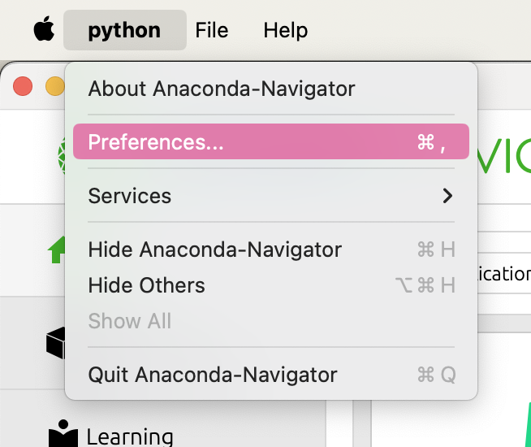
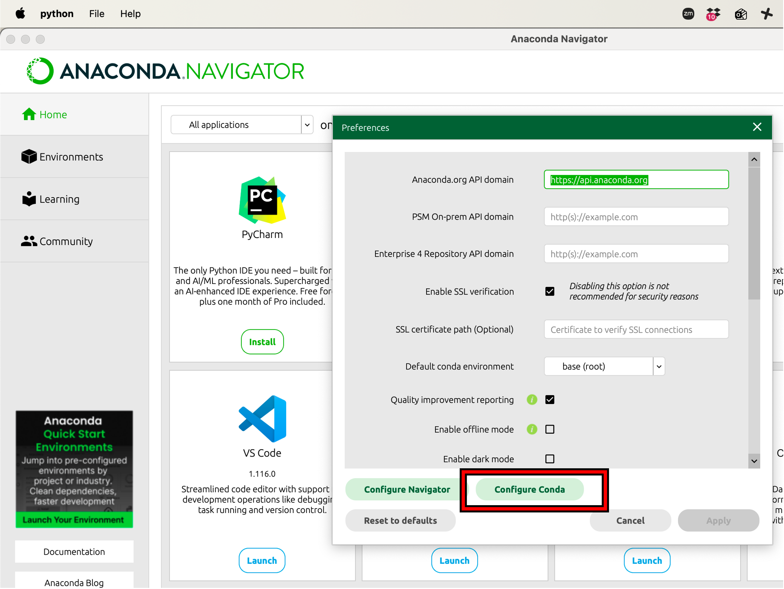
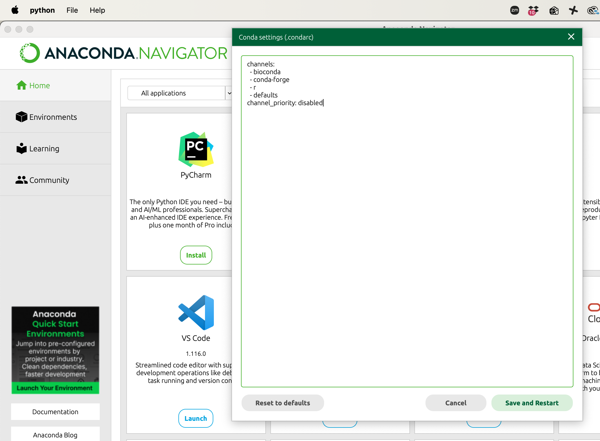

# Introduction to single-cell RNA-seq

| Audience | Computational skills required| Duration |
:----------|:----------|:----------|
| Biologists | [Introduction to R](https://hbctraining.github.io/Intro-to-R-flipped/) / [Introduction to Python](https://hbctraining.github.io/Intro-to-Python/) | 3-session online workshop (~7.5 hours of trainer-led time)|

## Description

This repository has teaching materials for a hands-on **Introduction to single-cell RNA-seq** workshop. This workshop will instruct participants on how to design a single-cell RNA-seq experiment, and how to efficiently manage and analyze the data starting from count matrices. This will be a hands-on workshop in which we will focus on using the Seurat package using R/RStudio or Scanpy using Python/JupyterLab. Working knowledge of R/Python is required or completion of the [Introduction to R workshop](https://hbctraining.github.io/Intro-to-R-flipped/)/[Introduction to Python workshop](https://hbctraining.github.io/Intro-to-Python/). 

::: callout-note
# Length of workshop
Please note that the schedule linked below assumes that learners will spend between 3-4 hours on reading through, and completing exercises from selected lessons between classes. The online component of the workshop focuses on more exercises and discussion/Q & A.

These materials were developed for a trainer-led workshop, but are also amenable to self-guided learning.
:::

## Learning Objectives

- Describe best practices for designing a single-cell RNA-seq experiment
- Describe steps in a single-cell RNA-seq analysis workflow
- Use Seurat/Scanpy and associated tools to perform analysis of single-cell expression data, including:
   - Data filtering, 
   - QC
   - Integration
   - Clustering
   - Marker identification
- Understand practical considerations for performing scRNA-seq, rather than in-depth exploration of algorithm theory


## Lessons
- [Workshop schedule (trainer-led learning)](schedule/schedule.qmd)
- [Self-learning](schedule/links-to-lessons.qmd)

## Installation Requirements

::: {.panel-tabset group="language"}

## R

### Applications

Download the most recent versions of R and RStudio for your laptop:

 - [R](http://lib.stat.cmu.edu/R/CRAN/) **(version 4.0.0 or above)**
 - [RStudio](https://www.rstudio.com/products/rstudio/download/#download)

### Packages

::: callout-note
# R Installation notes

**Note 1: Install the packages in the order listed below.**

**Note 2:  All the package names listed below are case sensitive!**

**Note 3**: If you have a Mac with an M1 chip, download and install this tool before intalling your packages: https://mac.r-project.org/tools/gfortran-12.2-universal.pkg

**Note 4**: At any point (especially if you’ve used R/Bioconductor in the past), in the console **R may ask you if you want to update any old packages by asking Update all/some/none? [a/s/n]:**. If you see this, **type "a" at the prompt and hit Enter** to update any old packages. _Updating packages can sometimes take quite a bit of time to run, so please account for that before you start with these installations._  

**Note 5:** If you see a message in your console along the lines of “binary version available but the source version is later”, followed by a question, **“Do you want to install from sources the package which needs compilation? y/n”, type n for no, and hit enter**.

:::

**(1)** Install the packages listed below from **CRAN** and **Bioconductor**. 

1. `tidyverse`
2. `Matrix`
3. `RCurl`
4. `scales`
5. `cowplot`
6. `BiocManager`
7. `Seurat`
8. `metap`
9. `reshape2`
10. `plyr`
11. `devtools`
12. `AnnotationHub`
13. `ensembldb`
14. `multtest`
15. `glmGamPoi`


**Please install them one-by-one as follows:**

```{r}
#| label: install_cran
#| eval: false
# CRAN installation
install.packages("tidyverse")
install.packages("Matrix")
install.packages("RCurl")
install.packages("scales")
install.packages("cowplot")
install.packages("BiocManager")
install.packages("Seurat")
install.packages("metap")
install.packages("reshape2")
install.packages("plyr")
install.packages("devtools")

# Bioconductor installation
library(BiocManager)
BiocManager::install("AnnotationHub")
BiocManager::install("ensembldb")
BiocManager::install("multtest")
BiocManager::install("glmGamPoi")
```

**(2)** Install Presto from GitHub using the `devtools::install_github()` function:

```{r}
#| label: install_github
#| eval: false
library(devtools)
devtools::install_github("immunogenomics/presto")
```

::: {.callout-warning collapse=true}
# `cmath` error
If you are on a Mac and getting errors about `fatal error: 'cmath' file not found` - Ensure that Xcode is installed. It can be downloaded from the App Store or via the command line with:

```{r}
#| label: install_xcode
#| eval: false
xcode-select --install
```

If you are getting errors about `ld: library 'emutls_w' not found” or “clang++: error: linker command failed with exit code 1` - You can try installing the appropriate gfortran compiler. More information on both of these steps can be found on the [R website](https://mac.r-project.org/tools/).
:::

**(3)** Finally, please check that all the packages were installed successfully by **loading them one at a time** using the `library()` function.  

```{r}
#| label: load_libraries
#| eval: false
library(Seurat)
library(tidyverse)
library(Matrix)
library(RCurl)
library(scales)
library(cowplot)
library(BiocManager)
library(metap)
library(reshape2)
library(plyr)
library(devtools)
library(AnnotationHub)
library(ensembldb)
library(multtest)
library(glmGamPoi)
library(presto)
```

**(4)** Once all packages have been loaded, run `sessionInfo()`.

```{r}
#| label: sessionInfo
#| eval: false
sessionInfo()
```

You can copy and paste the output into the app below to ensure that all of the packages were installed correctly.

<div style="width: 100%; max-width: 750px; margin: 0 auto;">
  <iframe
    id="session_info_R"
    src="apps/scRNA_sessionInfo_checks_R/index.html"
    style="width: 100%; border: 1px solid #ccc; border-radius: 6px;"
  ></iframe>
</div>

## Python

### Applications

Download the most recent version of Anaconda Navigator (Anaconda Distribution) for your laptop. **Do NOT install Miniconda:** [Anaconda Navigator](https://www.anaconda.com/download/success)


::: callout-note
# MGH download instructions
If you are at MGH, you will need to download the Anaconda Navigator from a non-MGH network. This may require you to disconnect from your VPN or use a non-MGH affliated WiFi network.
:::

### Check Channel Priority

1. Open Anaconda Navigator and from the toolbar at the top of the screen, select "python" and then "Preferences".

::: {#fig-sc-workflow .figure}
{width=200}

Open the Preferences menu from Anaconda Navigator.
:::

2. Within the pop-up left-click the button for "Configure Conda". 

::: {#fig-sc-workflow .figure}
{width=500}

Select "Configure Conda" to customize package installation settings.
:::

3. Ensure that the configuration file looks like so:

::: {#fig-sc-workflow .figure}
{width=630}

Packing installation setting, emphasizing the addition of `channel_priority` changes.
:::

You can copy paste the following text into the console:

```{python}
#| label: channel_priority
#| eval: false
channels:
  - bioconda
  - conda-forge
  - r
  - defaults
channel_priority: disabled
```

4. Then left-click "Save and Restart".

### Creating an Environment

Within Anaconda Navigator, select the **Environments** tab on the left-side. Then left-click the **Create** button to create a new environment. You will be prompted name your environment and select a version of Python. **Please name your environment "intro_scRNAseq" and select Python version 3.12.13 (likely not the default option).**

::: callout-important
# Python version 3.12.13
You may run into installation issues with a more current version of Python, so **please select Python version 3.12.13**.
:::

### Packages

**(1)** Next, we will need to install the packages that we will use in the workshop. Search for and install the following packages (_install with the exact same names listed here_) by marking the checkbox next to the desired package and clicking "Apply" and then selecting "Apply" in the pop-up window:

::: callout-note
# View all available packages
You may need to toggle the dropdown menu from "Installed" to "All" in order to view all packages available to you (installed or uninstalled).
:::

```{r}
#| label: package_Python
#| eval: false
scanpy
scvi-tools
ipywidgets
nb_conda_kernels
jupyterlab
numpy
pandas
matplotlib
seaborn
scikit-learn
scikit-misc
session-info2
```


::: callout-note
# Dependencies
Some packages may install dependency packages as well. For example, `scanpy` will likely install many dependency packages like `numpy`, `pandas`, `matplotlib`, `seaborn`, `scikit-learn` and `session-info2`.
:::

**(2)** After you have installed each of the following packages, select the "Home" tab in the Anaconda Navigator and left-click "Launch" under JupyterLab. This should open up JupyterLab within your web browser. Open a notebook within from the "intro_scRNAseq" environment. It should be the one named "Python [conda env:intro_scRNAseq]\*". When you open this notebook, it should have "Python [conda env:intro_scRNAseq]\*" in the top-right of the notebook. Create a cell then run the code below:

```{python}
#| label: import_packages
#| eval: false
# Import libraries
import scanpy
import scvi
import numpy
import pandas
import matplotlib.pyplot
import seaborn
from sklearn.decomposition import PCA
import skmisc
from session_info2 import session_info

# Show imported packages
session_info(dependencies=True)
```

_The first time importing all these packages may take a little while._

**(3)** Left-click on "Click to view session information", then copy and paste the output into the app below and left-click "Check my session_info" to ensure that all of the packages were installed correctly:

<div style="width: 100%; max-width: 750px; margin: 0 auto;">
  <iframe
    id="session_info_Python"
    src="apps/scRNA_sessionInfo_checks_Python/index.html"
    style="width: 100%; border: 1px solid #ccc; border-radius: 6px;"
  ></iframe>
</div>

:::

---

### Citation

To cite material from this course in your publications, please use:

::: callout-important
# Citation
Mary Piper, Meeta Mistry, Jihe Liu, William Gammerdinger, & Radhika Khetani. (2022, January 6). hbctraining/scRNA-seq_online: scRNA-seq Lessons from HCBC (first release). Zenodo. https://doi.org/10.5281/zenodo.5826256. 
:::

A lot of time and effort went into the preparation of these materials. Citations help us understand the needs of the community, gain recognition for our work, and attract further funding to support our teaching activities. Thank you for citing this material if it helped you in your data analysis.

<style>
  /* Heights only for the apps on this page */

  #session_info_R {
    height: 800px !important;
    max-height: 800px !important;
  }
  
  #session_info_Python {
    height: 800px !important;
    max-height: 800px !important;
  }
  
</style>
