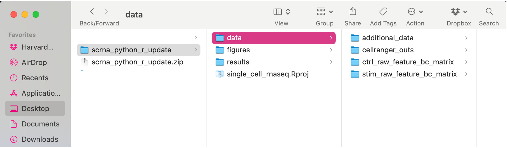

Approximate time: 90 minutes

## Learning Objectives:

- Setup environment for single-cell analysis.
- Establish good data and metmerged_adata management.
- Demonstrate how to import data and set up project for upcoming quality control analysis.

# Quality control set-up

::: {#fig-sc-workflow .figure}
{width=630}

Overview of the single-cell RNA-seq workflow.
:::

After quantifying gene expression we need to bring this data into our programming language to generate metrics for performing QC. In this lesson we will talk about the format(s) count data can be expected in, and how to load it in so we can move on to the QC step in the workflow. We will also discuss the dataset we will be using and the associated metmerged_adata.

***

# Exploring the example dataset

For this workshop we will be working with a single-cell RNA-seq dataset which is part of a larger study from [Kang et al, 2017](https://www.nature.com/articles/nbt.4042). In this paper, the authors present a computational algorithm that harnesses genetic variation (eQTL) to determine the genetic identity of each droplet containing a single cell (singlet) and identify droplets containing two cells from different individuals (doublets).

The data used to test their algorithm is comprised of pooled Peripheral Blood Mononuclear Cells (PBMCs) taken from eight lupus patients, split into control and interferon beta-treated (stimulated) conditions. 

::: {#fig-kang-2017 .figure}
{width=700}

Overview of the Kang et al. (2017) pooled PBMC single-cell RNA-seq study design.<br>
_Image credit: [Kang et al., 2017](https://www.nature.com/articles/nbt.4042)_
:::

### Raw data

This dataset is available on GEO ([GSE96583](https://www.ncbi.nlm.nih.gov/geo/query/acc.cgi?acc=GSE96583)), however the available counts matrix lacked mitochondrial reads, so we downloaded the BAM files from the SRA ([SRP102802](https://www-ncbi-nlm-nih-gov.ezp-prod1.hul.harvard.edu/sra?term=SRP102802)). These BAM files were converted back to FASTQ files, then run through [Cell Ranger](https://support.10xgenomics.com/single-cell-gene-expression/software/pipelines/latest/what-is-cell-ranger) to obtain the count data that we will be using.

::: callout-note
# Dataset availability
The count data for this dataset is also freely available from 10X Genomics and is used in the [Seurat tutorial](https://satijalab.org/seurat/v3.0/immune_alignment.html). 
:::

### Metmerged_adata

In addition to the raw data, we also need to collect **information about the data**; this is known as **metmerged_adata**. There is often a temptation to just start exploring the data, but it is not very meaningful if we know nothing about the samples that this data originated from.

Some relevant metmerged_adata for our dataset is provided below:

- The libraries were prepared using 10X Genomics version 2 chemistry
- The samples were sequenced on the Illumina NextSeq 500
- PBMC samples from eight individual lupus patients were separated into two aliquots each. 
  - One aliquot of PBMCs was activated by 100 U/mL of recombinant IFN-β for 6 hours. 
  - The second aliquot was left untreated. 
  - After 6 hours, the eight samples for each condition were pooled together in two final pools (stimulated cells and control cells). We will be working with these two, pooled samples. 
  - (*We did not demultiplex the samples because SNP genotype information was used to demultiplex in the paper and the barcodes/sample IDs were not readily available for this data. Generally, you would demultiplex and perform QC on each individual sample rather than pooling the samples.*)
- 12,138 and 12,167 cells were identified (after removing doublets) for control and stimulated pooled samples, respectively.

- Since the samples are PBMCs, we will expect immune cells, such as:
  - B cells
  - T cells
  - NK cells
  - Monocytes
  - Macrophages
  - Possibly megakaryocytes
  
**It is recommended that you have some expectation regarding the cell types you expect to see in a dataset prior to performing the QC.** This will inform you if you have any cell types with low complexity (lots of transcripts from a few genes) or cells with higher levels of mitochondrial expression. This will enable us to account for these biological factors during the analysis workflow.

None of the above cell types are expected to be low complexity or anticipated to have high mitochondrial content.

# Set up

For this workshop, we will be working with the files and folders that have been pre-generated for you.

::: callout-important
# Download data
::: {.panel-tabset group="language"}
## R
If you haven't done this already, the project can be accessed using [this link](https://www.dropbox.com/scl/fi/uoro3sbex3tj1e6m61z16/single_cell_rnaseq.zip?rlkey=cfay7tqm3ta5qlh2gph7h2wko&dl=1).

## Python
TODO
:::
:::

Once downloaded, you should see a file called `single_cell_rnaseq.zip` on your computer (likely, in your `Downloads` folder). 

1. Unzip this file. It will result in a folder of the same name. 
2. **Move the folder to the location on your computer where you would like to perform the analysis.**

TODO: make these instruction agnostic to language

3. Open up the folder. The contents will look like the screenshot below. 
4. **Locate the `.Rproj file` and double-click on it.** This will open up RStudio with the "single_cell_rnaseq" project loaded. 

::: callout-important
# Note for Windows OS users
When you open the project folder after unzipping, please check if you have a `data` folder with a sub folder also called `data`. If this is the case, please move all the files from the subfolder into the parent `data` folder.
:::

::: {#fig-project-structure .figure}
{width=600}


Project directory structure for the `single_cell_rnaseq` workshop materials.
:::

## Project organization

One of the most important parts of research that involves large amounts of data, is how best to manage it. We tend to prioritize the analysis, but there are many other important aspects of **data management that are often overlooked** in the excitement to get a first look at new data. The [HMS Data Management Working Group](https://datamanagement.hms.harvard.edu/), discusses in-depth some things to consider beyond the data creation and analysis.

One important aspect of data management is organization. For each experiment you work on and analyze data for, it is considered best practice to get organized by creating **a planned storage space (directory structure)**. We will do that for our single-cell analysis. 

::: {.panel-tabset group="language"}
## R

Look inside your project space and you will find that a directory structure has been setup for you:

```{r}
#| label: data_structure
#| eval: false
single_cell_rnaseq/
├── data
├── figures
├── results
├── scripts
└── single_cell_rnaseq.Rproj
```

### New script

Next, open a new Rscript file, and start with some comments to indicate what this file is going to contain:

```{r}
#| label: script_metmerged_adata
#| eval: false
# Load 10x single-cell data
# Introduction to single-cell RNA-seq workshop
# Author: Harvard Chan Bioinformatics Core
# June 2026
```

Save the Rscript as `quality_control.R`. Your working directory should look something like this:


::: {#fig-rstudio-singlecell .figure}
{width=600}

RStudio interface with the `single_cell_rnaseq` project opened.
:::

## Python

TODO

:::


### Loading libraries 

Now, we can load the necessary libraries:

::: {.panel-tabset group="language"}
## R

```{r}
#| label: R_load_libraries
#| warning: false
# Load libraries
library(Seurat)
library(tidyverse)
```

## Python

```{python}
#| label: py_load_libraries
#| warning: false
# Load packages
import scanpy as sc
import numpy as np
import seaborn as sns
import matplotlib.pyplot as plt
```

:::

# Loading single-cell RNA-seq count data 

After processing 10X data using its proprietary software Cell Ranger, you will have an `outs` directory (always). Within this directory you will find a number of different files including the files listed below:

| File / Folder                | Description                                                                                                                                                                                                                     |
|-----------------------------|---------------------------------------------------------------------------------------------------------------------------------------------------------------------------------------------------------------------------------|
| `web_summary.html`          | Report that explores different QC metrics, including the mapping metrics, filtering thresholds, estimated number of cells after filtering, and information on the number of reads and genes per cell after filtering.            |
| BAM alignment files         | Files used for visualization of the mapped reads and for re-creation of FASTQ files, if needed                                                                                                                                  |
| `filtered_feature_bc_matrix`| Folder containing all files needed to construct the count matrix using data filtered by Cell Ranger                                                                                                                             |
| `raw_feature_bc_matrix`     | Folder containing all files needed to construct the count matrix using the raw unfiltered data                                                                                                                                  |
While Cell Ranger performs filtering on the expression counts (see note below), we wish to perform our own QC and filtering because we want to account for the biology of our experiment/biological system. Given this **we are only interested in the `raw_feature_bc_matrix` folder** in the Cell Ranger output. 

::: {.callout-note collapse="true"}
# Why do we not use the `filtered_feature_bc_matrix` folder?

The `filtered_feature_bc_matrix` uses [internal filtering criteria by Cell Ranger](https://support.10xgenomics.com/single-cell-gene-expression/software/pipelines/latest/algorithms/overview), and we do not have control of what cells to keep or abandon.
 
The filtering performed by Cell Ranger when generating the `filtered_feature_bc_matrix` is often good; however, sometimes data can be of very high quality and the Cell Ranger filtering process can remove high quality cells.

In addition, it is generally preferable to explore your own data while taking into account the biology of the experiment for applying thresholds during filtering. For example, if you expect a particular cell type in your dataset to be smaller and/or not as transcriptionally active as other cell types in your dataset, these cells have the potential to be filtered out. However, with Cell Ranger v3 they have tried to account for cells of different sizes (for example, tumor vs infiltrating lymphocytes), and now may not filter as many low quality cells as needed.

:::

Regardless of the technology or pipeline used to process your raw single-cell RNA-seq sequence data, the output with quantified expression will generally be the same. That is, for each individual sample you will have the following **three files**:

1. A file with the **cell IDs**, representing all cells quantified
2. A file with the **gene IDs**, representing all genes quantified
3. A **matrix of counts** per gene for every cell

We can explore these files by clicking the `data/ctrl_raw_feature_bc_matrix` folder:

### 1. `barcodes.tsv` 
This is a text file which contains all cellular barcodes present for that sample. Barcodes are listed in the order of data presented in the matrix file (i.e. these are the column names). 

```{r}
#| label: tbl-barcodes
#| tbl-cap: First several rows of the `barcodes.tsv.gz` file
#| echo: false
bcs <- read_tsv("data/ctrl_raw_feature_bc_matrix/barcodes.tsv.gz",
                col_names = FALSE)
bcs %>% head() %>% knitr::kable()
```


### 2. `features.tsv`
This is a text file which contains the identifiers of the quantified genes. The source of the identifier can vary depending on what reference (i.e. Ensembl, NCBI, UCSC) you use in the quantification methods, but most often these are official gene symbols. The order of these genes corresponds to the order of the rows in the matrix file (i.e. these are the row names).

```{r}
#| label: tbl-features
#| tbl-cap: First several rows of the `features.tsv.gz` file
#| echo: false
fts <- read_tsv("data/ctrl_raw_feature_bc_matrix/features.tsv.gz",
                col_names = FALSE)
fts %>% head() %>% knitr::kable()
```
  

### 3. `matrix.mtx`
This is a text file which contains a matrix of count values. The rows are associated with the gene IDs above and columns correspond to the cellular barcodes. Note that there are **many zero values** in this matrix.

```{r}
#| label: tbl-mtx
#| tbl-cap: First 10 rows and columns of the `matrix.mtx.gz` file
#| echo: false
mtx <- Matrix::readMM("data/ctrl_raw_feature_bc_matrix/matrix.mtx.gz")
mtx[1:10, 1:10] %>% knitr::kable()
```

Loading this data requires us to **use functions that allow us to efficiently combine these three files into a single count matrix.** However, instead of creating a regular matrix data structure, the functions we will use create a **sparse matrix** to reduce the amount of memory (RAM), processing capacity (CPU) and storage required to work with our huge count matrix. 

Different methods for reading in data include:

- Reading into the `matrix.mtx` file directly to manually create our single-cell object (AnnData or Seurat). This requires also reading in the `features.tsv` and `barcodes.tsv` as tables to supply the barcodes and gene names. For specific code and instructions on how to do this in _R_ please see [these additional material](Aside_readMM_loadData.qmd).
- Many packages have built-in function to load a CellRanger directory as input directly. With this method individual files do not need to be loaded in, instead the function will load and combine them into a sparse matrix.
  - **`Read10X()`** for Seurat
  - **`read_10x_mtx()`** for scanpy

***We will be using this function to load in our data!***

### Reading in a single sample

If we had a single sample, we could generate the count matrix and then subsequently create our object:

::: {.panel-tabset group="language"}
## R

The Seurat object is a custom list-like object that has well-defined spaces to store specific information/data. You can find more information about the slots in the Seurat object [at this link](https://github.com/satijalab/seurat/wiki/Seurat).

```{r}
#| label: R_read_in_single_dataset
# How to read in 10X data for a single sample (output is a sparse matrix)
ctrl_counts <- Read10X(data.dir = "data/ctrl_raw_feature_bc_matrix")

# Turn count matrix into a Seurat object (output is a Seurat object)
ctrl <- CreateSeuratObject(counts = ctrl_counts,
                           min.features = 100)
ctrl
```

::: callout-note
# `min.features` argument
The `min.features` argument specifies the minimum number of genes that need to be detected per cell. This argument will filter out poor quality cells that likely just have random barcodes encapsulated without any cell present. Usually, cells with less than 100 genes detected are not considered for analysis.
:::

**Seurat automatically creates some metmerged_adata** for each of the cells when you use the `Read10X()` function to read in data. This information is stored in the `meta.data` slot within the Seurat object. 

```{r}
#| label: R_head_ctrl_dataset
#| eval: false
# Explore the metmerged_adata
head(ctrl@meta.data)
```

```{r}
#| label: tbl-R_ctrl_metmerged_adata
#| tbl-cap: First several rows of a the `ctr@meta.data`
#| echo: false
ctrl@meta.data %>% head() %>% knitr::kable()
```


## Python

With a single sample, we can generate an AnnData object:

```{python}
#| label: py_read_in_single_dataset
ad = sc.read_10x_mtx("data/ctrl_raw_feature_bc_matrix/")
ad
```

We can see from this callout that we have 737,280 cells and 33,538 genes which is clearly too many cells! So we can do some very low level filtration to remove any cells that we know are "empty". 

The `filter_cells()` function specifies the minimum number of genes that need to be detected per cell. This argument will filter out poor quality cells that likely just have random barcodes encapsulated without any cell present. Usually, cells with less than 100 genes detected are not considered for analysis.

```{python}
#| label: py_filter_cells
sc.pp.filter_cells(ad, min_genes = 100)
ad
```

Immediately we can see that we are now left with 15,688 cells.

At this point we do not have any inforation stored in our metmerged_adata, which is stored in the `.obs` slot of our AnnData object. Therefore, we will use the `pp.calculate_qc_metrics()` function:

```{python}
#| label: py_calc_qc_metrics
#| eval: false
sc.pp.calculate_qc_metrics(ad,
                           percent_top = None,
                           log1p = False,
                           inplace = True)
ad.obs.head()
```

```{python}
#| label: tbl-py_show_metmerged_adata
#| tbl-cap: First several rows of `ad.obs`
#| echo: false
#| results: asis
sc.pp.calculate_qc_metrics(ad,
                           percent_top = None,
                           log1p = False,
                           inplace = True)
print(ad.obs.head().to_markdown())
```

:::

What do the columns of metmerged_adata mean?

- `orig.ident`: this often contains the sample identity if known, but will default to "SeuratProject"
- `nCount_RNA`: number of UMIs per cell
- `nFeature_RNA`: number of genes detected per cell

### Reading in multiple samples with a `for loop`

In practice, you will likely have several samples that you will need to read in data for, and that can get tedious and error-prone if you do it one at a time. So, to make the data import into R more efficient we can use a `for` loop, which will iterate over a series of commands for each of the inputs given and create seurat objects for each of our samples. 

::: {.callout-note collapse="true"}
# `for` loop syntax

::: {.panel-tabset group="language"}
## R

```{r}
#| label: R_for_loop_example
#| eval: false
## DO NOT RUN
for (variable in input){
	command1
	command2
	command3
}
```

## Python

```{python}
#| label: py_for_loop_example
#| eval: false
## DO NOT RUN
for variable in input:
	command1
	command2
	command3
```

:::
:::

Today we will use it to **iterate over the two sample folders** and execute two commands for each sample as we did above for a single sample.

Go ahead and copy and paste the code below into your script and then run it.

::: {.panel-tabset group="language"}
## R

1. Read in the count data (`Read10X()`) and
2. Create the Seurat objects from the read in data (`CreateSeuratObject()`)

```{r}
#| label: R_read_in_both_datasets
sample_names <- c("ctrl", "stim")

# Empty list to populate seurat object for each sample
list_seurat <- list()

for (sample in sample_names) {
    # Path to data directory
    data_dir <- paste0("data/", sample, "_raw_feature_bc_matrix")

    # Create a Seurat object for each sample
    seurat_data <- Read10X(data.dir = data_dir)
    seurat_obj <- CreateSeuratObject(counts = seurat_data,
                                      min.features = 100,
                                      project = sample)

    # Save seurat object to list
    list_seurat[[sample]] <- seurat_obj
}
```

## Python

1. Generate list of sample names
2. Read in the count data (`read_10x_mtx()`)
3. Filter out the very low quality data
4. Add the sample information to the metmerged_adata
5. Store AnnData to a dictionary (for later merging)

Go ahead and copy and paste the code below into your script and then run it.

```{python}
#| label: py_load_datasets
sample_names = ["ctrl", "stim"]
dict_ad = dict()

for sample in sample_names:
    # Get the path for each sample
    path_data = f"data/{sample}_raw_feature_bc_matrix"
    print(path_data)

    # Load AnnData object
    # Filter and add sample metmerged_adata
    ad = sc.read_10x_mtx(path_data)
    sc.pp.filter_cells(ad, min_genes=100)
    ad.obs["sample"] = sample

    dict_ad[sample] = ad
```

:::

Let's break down the `for loop` and go over the different lines of code:

::: callout-note
# Breaking down the for loop

#### Step 1: Specify inputs

For this dataset, we have two samples and two associated folders that we would like to use as input to create the two Seurat objects:

- `ctrl_raw_feature_bc_matrix` 
- `stim_raw_feature_bc_matrix`

We can specify these sample names in the *input* part for our `for loop` as elements of a vector using `c()`. We are assigning these to a *variable* and we can call that variable anything we would like (try to give it a name that makes sense). In this example, we called the *variable* `sample`. 
 
During the execution of the above loop, `sample` will first contain the value *"ctrl"*, run through the commands all the way through to storing the seurat object as a list. Next, it will contain the value *"stim"* and once again run through all the commands. If you had 15 folders as input, instead of 2, the above code will run through 15 times, for each of your data folders.

To start, let us test out what happens if we print out what `sample` looks like and the associated `data_dir` path we specify.

```{r}
#| label: create_individual_seurat_objects
#| eval: false
sample_names <- c("ctrl", "stim")
# Empty list to populate seurat object for each sample
list_seurat <- list()

# Create each individual Seurat object
for (sample in sample_names) {
    print(sample)
    # Path to data directory
    data_dir <- paste0("data/", sample, "_raw_feature_bc_matrix")
    print(data_dir)
}
```

#### Step 2: Read in data for the input

We can continue our `for loop` by adding a line to read in data with `Read10X()`:

```{r}
#| label: read_in_10Xdata
#| eval: false
## DO NOT RUN
        seurat_data <- Read10X(data.dir = data_dir)
```

#### Step 3: Create Seurat object from the 10X count data

Now, we can create the Seurat object by using the `CreateSeuratObject()` nction, adding in the argument `project`, where we can add the sample name.

```{r}
#| label: assign_data_to_object
#| eval: false
## DO NOT RUN
        seurat_obj <- CreateSeuratObject(counts = seurat_data, 
                                         min.features = 100, 
                                         project = sample)        
```

#### Step 4: Assign Seurat object to a new variable based on sample

The last command assignts the Seurat object created (`seurat_obj`) to the empty list that was initialized before the for loop. In this way, when we iterate and move on to the next sample in our `input` we will not overwrite the Seurat object created in the previous iteration:

```{r}
#| label: add_seurat_object_to_list
#| eval: false
## DO NOT RUN
        list_seurat[[sample]] <- seurat_obj
}
```

:::

Now that we have created both of these objects, let's take a quick look at the list we just created. We should see that there are two Seurat objects in our list that correspond to each sample.

::: {.panel-tabset group="language"}
## R

```{r}
#| label: R_list_seurat_objects
list_seurat
```

## Python

```{python}
#| label: py_show_dict_anndata
dict_ad
```


:::

Next, we need to merge these objects together into a single Seurat object. This will make it easier to run the QC steps for both sample groups together and enable us to easily compare the data quality for all the samples.  

::: {.panel-tabset group="language"}
## R

We can use the `merge()` function from the Seurat package to do this. Here, we also specify `add.cell.id` because the same cell IDs can be used for different samples so we add a **sample-specific prefix** to the cell IDs to ensure that they are unique.

```{r}
#| label: merge_seurat_objects
# Create a merged Seurat object
merged_seurat <- merge(x = list_seurat[["ctrl"]], 
                       y = list_seurat[["stim"]], 
                       add.cell.id = c("ctrl", "stim"))

merged_seurat
```

::: {.callout-note collapse="true"}
# What if I am merging more than two samples?
Seurat now has functionality to merge many samples together. You can do this quite easily by adding all sample objects to the `y` argument in a vector format. An example is provided below: 

```{r}
#| label: merging_multiple_objects
#| eval: false
## DO NOT RUN
 merged_seurat <- merge(x = seurat_list[[1]], 
                        y = seurat_list[[2:length(seurat_list)]],
                        add.cell.id = names(seurat_list))
```       
:::

However you may notice that when we look at our seurat object that we have 2 `layers` (count matrices) when it says:

`2 layers present: counts.ctrl, counts.stim`

This indicates that the matrices for each sample are being stored separately. Instead, we want to concatenate these together so that in the future when we run normalization, it is run on the entire dataset collectively. So to create one `counts` matrix, that is not sample/batch specific, we run the `JoinLayers()` function.

```{r}
#| label: JoinLayers
# Concatenate the count matrices of both samples together
merged_seurat <- JoinLayers(merged_seurat)
merged_seurat
```

Now that we’ve merged and joined the dataset as we wanted, we can verify that it looks correct. In the merged object’s metmerged_adata, we should see the rowname prefixes added by `add.cell.id` and the `orig.ident` values set during `CreateSeuratObject` with `project = sample`:

```{r}
#| label: inspect_seurat_object_head
#| eval: false
# Check that the merged object has the appropriate sample-specific prefixes
head(merged_seurat@meta.data)
```


```{r}
#| label: tbl-merged_seurat_metmerged_adata_head
#| tbl-cap: First several rows of a the `merged_seurat@meta.data`
#| echo: false
merged_seurat@meta.data %>% head() %>% knitr::kable()
```

```{r}
#| label: inspect_seurat_object_tail
#| eval: false
# Check that the merged object has the appropriate sample-specific prefixes
tail(merged_seurat@meta.data)
```

```{r}
#| label: tbl-merged_seurat_metmerged_adata_tail
#| tbl-cap: Last several rows of a the `merged_seurat@meta.data`
#| echo: false
merged_seurat@meta.data %>% tail() %>% knitr::kable()
```

## Python

We can use the `concatenate()` function to do this. We also specify several arguments to ensure the merge is done correctly with:

- join
- batch_key
- batch_categories
- index_unique

```{python}
#| label: concatenate_datasets
# Pooling together the samples
merged_adata = sc.AnnData.concatenate(
    *list(dict_ad.values()), # the asterisk unpacks the list
    join='outer', 
    batch_key = 'sample', 
    batch_categories = sample_names,
    index_unique = '_'
)

merged_adata
```


If we look at the metmerged_adata of the merged object we should be able to see the correct samples in the metmerged_adata:

```{python}
#| label: show_meta_merged_adata
#| eval: false
merged_adata.obs.head()
merged_adata.obs.tail()
```

```{python}
#| label: tbl-py_show_meta_merged_adata_head
#| tbl-cap: First several rows of a the `merged_adata.obs`
#| echo: false
#| results: asis
print(merged_adata.obs.head().to_markdown())
```

```{python}
#| label: tbl-py_show_meta_merged_adata_tail
#| tbl-cap: Last several rows of a the `merged_adata.obs`
#| echo: false
#| results: asis
print(merged_adata.obs.tail().to_markdown())
```

:::

```{python}
#| label: py_intructor_save
#| eval: false
#| echo: false
merged_adata.write_h5ad("intermediate/03_merged_adata.h5ad")
```

```{r}
#| label: R_instructor_save
#| eval: false
#| echo: false
saveRDS(merged_seurat, "intermediate/03_merged_seurat.RDS")
```