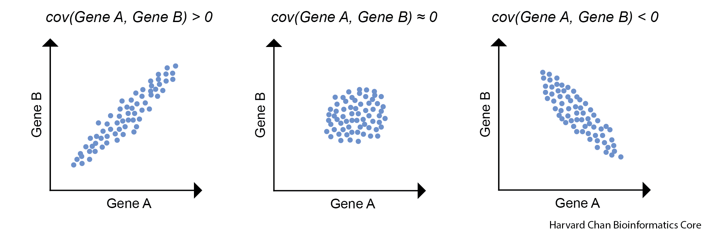
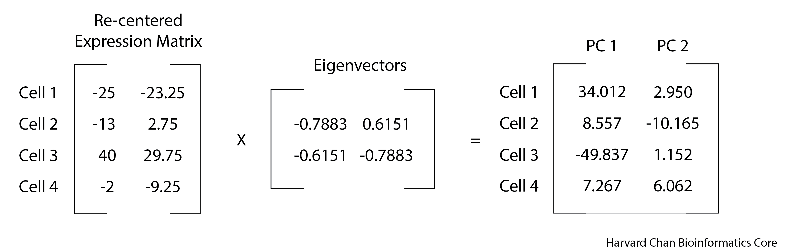

```{r}
#| label: load_libraries
#| echo: false
# Load libraries
library(Seurat)
filtered_seurat <- readRDS("intermediate/05_filtered_seurat.RDS")
```

Approximate time: 45 minutes

## Learning Objectives

- Derive the covariance matrix used for Principal Components Analysis
- Explain the roles of eigenvectors and eigenvalues within a Principal Components Analysis
- Compare and contrast our Principal Components Analysis to the output of `prcomp()` (R)/`PCA()` (Python)

## Background

Principal Components Analysis is a ***dimensionality-reduction method employed to stratify data by their variance***. In other words, points that are more closely together on a PCA are more similar to each other, while points that are more dissimilar to each other will be further apart. As a result, you would likely expect ***similar cells from the same cell type to cluster near each other and apart from distinctly different cell types***. In order to demonstrate how Principal Components Analysis works we are going to describe how the process works in high-dimensional data, then work through it using a two-dimensional example data set.

Consider a single-cell experiment where you have the expression value for every gene in each cell. Let's hypothetically say that our sample has data from 25,000 genes. We could plot this 25,000-dimensional space where each dimension represents a given gene's expression and each point represents a cell in that 25,000-dimensional space. However, that is rather unintuitive and many of those dimensions are uninteresting, so we would like to reduce the dimensionality to the axes that separate the variance the most. This is what we will be doing with a Principal Components Analysis.

From a high-level perspective, what we will be doing is:

- Finding the vector in that 25,000-dimensional space that has the most variance in it.
- Looking for another vector that is orthogonal (a 90&deg; angle but in multi-dimensional space) to the first vector that explains the most of the remaining variance. We continue this process until you have exhausted all source of variation from your dataset. However, in practice, people oftentimes stop after a few dozen. 
- Use these vectors to transform your original data into Principal Components space.

## Setting up to calculate Eigenvalues and Eigenvectors

Let's first set-up a place for us to do our work in.

::: {.panel-tabset group="language"}
### R

Open a new R script and save it as `PCA-example.R`. Next, we will be using some functions from `tidyverse` in the lesson, so we will need to load it:

```{r}
#| label: load_tidyverse
# Load libraries
library(tidyverse)
```

### Python

Open a new JupyterLab notebook and save it as `PCA-example.ipynb`. Next, we will be using some functions from `numpy`, `pandas`, `matplotlib.pyplot`, `seaborn` and `scikit-learn` in the lesson, so we will need to import them:

```{python}
#| label: load_Python
# Import libraries
import numpy as np
import pandas as pd
import matplotlib.pyplot as plt
import seaborn as sns
from sklearn.decomposition import PCA
```

:::

### Creating an example data set

We are going to discuss the steps for deriving a Principal Components analysis, but in order to do it, we are going to use an example dataset. Let's start by creating a dataset that has gene expression values for two genes from four cells.

::: {.panel-tabset group="language"}

### R

```{r}
#| label: create_dataset_R
# Create a vector for Cell IDs
cells <- c("Cell_1", "Cell_2", "Cell_3", "Cell_4")
# Create a vector to hold expression values for Gene A across all of the cells
Gene_A <- c(0, 12, 65, 23)
# Create a vector to hold expression values for Gene B across all of the cells
Gene_B <- c(4, 30, 57, 18)

# Create a tibble to hold the cell names and expression values
expression_tibble <- tibble(cells, Gene_A, Gene_B)

# View the expression tibble
expression_tibble
```

### Python

```{python}
#| label: create_dataset_python
# Create a list for Cell IDs
cells = ["Cell_1", "Cell_2", "Cell_3", "Cell_4"]
# Create a list to hold expression values for Gene A across all of the cells
Gene_A = [0, 12, 65, 23]
# Create a list to hold expression values for Gene B across all of the cells
Gene_B = [4, 30, 57, 18]

# Create a DataFrame to hold the cell names and expression values
expression_df = pd.DataFrame({
    "cells": cells,
    "Gene_A": Gene_A,
    "Gene_B": Gene_B
}).set_index("cells") 

# View the expression dataframe
expression_df
```

:::

Let's next get an idea of what our data looks like by plotting it.

::: {.panel-tabset group="language"}
### R

```{r}
#| label: fig-plot_raw_data_R
#| fig-cap: "Plot of the raw expression data for each cell"
# Create a plot to view the raw expression data
ggplot(expression_tibble,
       aes(x = Gene_A,
           y = Gene_B,
           label = cells)) +
  geom_point(color = "cornflowerblue") +
  geom_text(hjust = 0,
            vjust = -1) +
  xlim(0, 80) +
  ylim(0, 80) +
  theme_bw() +
  xlab("Gene A") +
  ylab("Gene B") +
  ggtitle("Example Expression Values from Four Cells") +
  theme(plot.title = element_text(hjust = 0.5))
```

### Python

```{python}
#| label: plot_raw_data_Python_show
#| eval: false
#| echo: true
# Set the theme to "whitegrid"
sns.set(style="whitegrid")

# Initialize a plot with a specific size
plt.figure(figsize = (8, 6))

# Add a scatterplot layer to the plot
expression_plot = sns.scatterplot(data = expression_df,
                x = "Gene_A", 
                y = "Gene_B",
                color = "cornflowerblue")

# Set x-axis limits
plt.xlim(left = -5,
         right = 80)

# Set y-axis limits
plt.ylim(bottom = -5,
         top = 80)

# Add Cell labels
for cell_id, row in expression_df.iterrows():
    expression_plot.text(
        x = row["Gene_A"] + 1,
        y = row["Gene_B"] + 1,
        s = cell_id,
        fontsize = 9,
        ha = "left",
        va = "bottom"
    )

# Change the text of the x-axis label
plt.xlabel(xlabel = "Gene A")

# Change the text of the y-axis label
plt.ylabel(ylabel = "Gene B")

# Add plot title
plt.title(label = "Example Expression Values from Four Cells")

# Render the plot
plt.show()
```

```{python}
#| label: fig-plot_raw_data_Python_hidden
#| fig-cap: "Plot of the raw expression data for each cell."
#| echo: false

def plot_raw_data(expression_df):
    # Set the theme to "whitegrid"
    sns.set(style="whitegrid")

    # Initialize a plot with a specific size
    fig, ax = plt.subplots(figsize=(8, 6))

    # Add a scatterplot layer to the plot
    expression_plot = sns.scatterplot(
        data=expression_df,
        x="Gene_A",
        y="Gene_B",
        color="cornflowerblue",
        ax=ax
    )

    # Set axis limits via the Axes object
    ax.set_xlim(-5, 80)
    ax.set_ylim(-5, 80)

    # Add cell labels
    for cell_id, row in expression_df.iterrows():
        ax.text(
            x=row["Gene_A"] + 1,
            y=row["Gene_B"] + 1,
            s=cell_id,
            fontsize=9,
            ha="left",
            va="bottom"
        )

    # Axis labels
    ax.set_xlabel("Gene A")
    ax.set_ylabel("Gene B")

    # Title
    ax.set_title("Example Expression Values from Four Cells")

    return fig, ax

fig, ax = plot_raw_data(expression_df)
plt.show()
```

:::

As a reminder, if were to consider our dataset, it would have ***`r format(nrow(filtered_seurat), scientific=FALSE)`*** genes and ***`r format(ncol(filtered_seurat), scientific=FALSE)`*** cells, so this is a simplified example. 

### Re-centering the dataset

The first step of PCA is to find the central spot among all of our datapoints (cells) and use that as the origin to re-center the data. In order to do this, we need to do two steps:

#### Find the center of the data

We can find the center of the data by taking the average gene expression across each gene (dimension).

::: {.panel-tabset group="language"}
### R

```{r}
#| label: center_of_data_R
# Determine the center of the data by:
# Finding the average expression of gene A
Gene_A_mean <- mean(expression_tibble$Gene_A)
# Finding the average expression of gene B
Gene_B_mean <- mean(expression_tibble$Gene_B)

# Create a vector to hold the center of the data
center_of_data <- c(Gene_A_mean, Gene_B_mean)
# Assign names to the components of the vector
names(center_of_data) <- c("Gene_A", "Gene_B")

# Print out the center_of_data vector
center_of_data
```

### Python

```{python}
#| label: center_of_data_Python
# Determine the center of the data by:
# Finding the average expression of gene A
Gene_A_mean = expression_df["Gene_A"].mean()
# Finding the average expression of gene B
Gene_B_mean = expression_df["Gene_B"].mean()

center_of_data = {
    "Gene_A": Gene_A_mean,
    "Gene_B": Gene_B_mean,
}

# Print out the center_of_data dictionary
print(center_of_data)
```

:::

The new center of the data will be where ***( `r center_of_data` )*** currently is. We can visualize this center and inspect that this is does in fact appear to be roughly in the middle of the data.

::: {.panel-tabset group="language"}
### R

``` {r}
#| label: fig-new_center_plot_R
#| fig-cap: "Raw expression data with the center of data highlighted."
# View where the center of the data is located
ggplot(expression_tibble,
       aes(x = Gene_A, 
           y = Gene_B,
           label = cells)) +
  geom_point(color = "cornflowerblue") +
  annotate(geom = "point",
           x = Gene_A_mean,
           y = Gene_B_mean,
           color = "red",
           size = 3) +
  geom_text(hjust = 0,
            vjust = -1) +
  annotate(geom = "text",
           x = Gene_A_mean,
           y = Gene_B_mean,
           color = "red",
           label="New Center",
           hjust = 0,
           vjust = -1) +
  xlim(0, 80) +
  ylim(0, 80) +
  theme_bw() +
  xlab("Gene A") +
  ylab("Gene B") +
  ggtitle("Example Expression Values from Four Cells") +
  theme(plot.title = element_text(hjust = 0.5))
```

### Python

```{python}
#| label: new_center_plot_Python_show
#| eval: false
#| echo: true
# Set the theme to "whitegrid"
sns.set(style="whitegrid")

# Initialize a plot with a specific size
plt.figure(figsize = (8, 6))

# Add a scatterplot layer to the plot
expression_plot = sns.scatterplot(data = expression_df,
                x = "Gene_A", 
                y = "Gene_B",
                color = "cornflowerblue")

# Set x-axis limits
plt.xlim(left = -5,
         right = 80)

# Set y-axis limits
plt.ylim(bottom = -5,
         top = 80)

# Add Cell labels
for cell_id, row in expression_df.iterrows():
    expression_plot.text(
        x = row["Gene_A"] + 1,
        y = row["Gene_B"] + 1,
        s = cell_id,
        fontsize = 9,
        ha = "left",
        va = "bottom"
    )

# Add the new center in red
expression_plot.scatter(x = Gene_A_mean,
             y = Gene_B_mean,
             color = "red")

# Add label for new center
expression_plot.text(x = Gene_A_mean + 1,
          y = Gene_B_mean + 1,
          s = "New Center",
          color = "red")

# Change the text of the x-axis label
plt.xlabel(xlabel = "Gene A")

# Change the text of the y-axis label
plt.ylabel(ylabel = "Gene B")

# Add plot title
plt.title(label = "Example Expression Values from Four Cells")

# Render the plot
plt.show()
```

```{python}
#| label: fig-new_center_plot_Python_hidden
#| fig-cap: "Raw expression data with the center of data highlighted."
#| echo: false

def new_center_plot(expression_df, Gene_A_mean, Gene_B_mean):
    # Set the theme to "whitegrid"
    sns.set(style="whitegrid")

    # Initialize a plot with a specific size
    fig, ax = plt.subplots(figsize=(8, 6))

    # Add a scatterplot layer to the plot
    sns.scatterplot(
        data=expression_df,
        x="Gene_A",
        y="Gene_B",
        color="cornflowerblue",
        ax=ax
    )

    # Set axis limits via the Axes object
    ax.set_xlim(-5, 80)
    ax.set_ylim(-5, 80)

    # Add cell labels
    for cell_id, row in expression_df.iterrows():
        ax.text(
            x=row["Gene_A"] + 1,
            y=row["Gene_B"] + 1,
            s=cell_id,
            fontsize=9,
            ha="left",
            va="bottom"
        )

    # Add the new center in red
    ax.scatter(
        x=Gene_A_mean,
        y=Gene_B_mean,
        color="red"
    )

    # Add label for new center
    ax.text(
        x=Gene_A_mean + 1,
        y=Gene_B_mean + 1,
        s="New Center",
        color="red"
    )

    # Axis labels
    ax.set_xlabel("Gene A")
    ax.set_ylabel("Gene B")

    # Title
    ax.set_title("Example Expression Values from Four Cells")

    return fig, ax

fig, ax = new_center_plot(expression_df, Gene_A_mean, Gene_B_mean)
plt.show()
```

:::

#### Translate the points from their raw expression coordinates to coordinates centered around the center of the data

Next, we need to shift the points so that the center of the data corresponds to the origin. We can do this by subtracting the mean value for each gene from the raw values.

::: {.panel-tabset group="language"}
### R

```{r}
#| label: recentered_data_R
# Shift the data points so that they data is centered on the origin
recentered_expression_tibble <- expression_tibble %>%
  mutate(
    Gene_A = Gene_A - Gene_A_mean,
    Gene_B = Gene_B - Gene_B_mean
  )

# Print out the re-centered data
recentered_expression_tibble
```

### Python

```{python}
#| label: recentered_data_Python
# Shift the data so it is centered on the origin
recentered_expression_df = expression_df.assign(
    Gene_A = expression_df["Gene_A"] - Gene_A_mean,
    Gene_B = expression_df["Gene_B"] - Gene_B_mean
)

# Print out the re-centered data
print(recentered_expression_df)
```

:::

*As with any data analysis, it is always a good idea to visualize your data to ensure that it appears to behaving how you intended.* So let's visualize our re-centered data to ensure that the data appears centered around the origin. 

::: {.panel-tabset group="language"}
### R

```{r}
#| label: fig-plot_recentered_data_R
#| fig-cap: "Scatterplot of re-centered Gene A vs Gene B expression with the new center at the origin."
# Plot the raw data after it has been shifted to have the center of the data align with the origin
ggplot(recentered_expression_tibble,
       aes(x = Gene_A,
           y = Gene_B,
           label = cells)) +
  geom_point(color = "cornflowerblue") +
  annotate(geom = "point",
           x = 0,
           y = 0,
           color = "red",
           size = 3) +
  geom_text(hjust = 0,
            vjust = -1) +
  annotate(geom = "text",
           x = 0,
           y = 0,
           color = "red",
           label="New Center",
           hjust = 0,
           vjust = -1) +
  xlim(-50, 50) +
  ylim(-50, 50) +
  theme_bw() +
  xlab("Gene A") +
  ylab("Gene B") +
  ggtitle("Example Re-centered Expression Values from Four Cells") +
  theme(plot.title = element_text(hjust = 0.5))
```

### Python

```{python}
#| label: plot_recentered_data_Python_show
#| eval: false
#| echo: true
# Set the theme to "whitegrid"
sns.set(style="whitegrid")

# Initialize a plot with a specific size
plt.figure(figsize = (8, 6))

# Add a scatterplot layer to the plot
recentered_expression_plot = sns.scatterplot(data = recentered_expression_df,
                x = "Gene_A", 
                y = "Gene_B",
                color = "cornflowerblue")

# Set x-axis limits
plt.xlim(left = -55,
         right = 55)

# Set y-axis limits
plt.ylim(bottom = -55,
         top = 55)

# Add Cell labels
for cell_id, row in recentered_expression_df.iterrows():
    recentered_expression_plot.text(
        x = row["Gene_A"] + 1,
        y = row["Gene_B"] + 1,
        s = cell_id,
        fontsize = 9,
        ha = "left",
        va = "bottom"
    )

# Add the new center in red
recentered_expression_plot.scatter(x = 0,
             y = 0,
             color = "red")

# Add label for new center
recentered_expression_plot.text(x = 1,
          y = 1,
          s = "New Center",
          color = "red")

# Change the text of the x-axis label
plt.xlabel(xlabel = "Gene A")

# Change the text of the y-axis label
plt.ylabel(ylabel = "Gene B")

# Add plot title
plt.title(label = "Example Re-centered Expression Values from Four Cells")

# Render the plot
plt.show()
```

```{python}
#| label: fig-plot_recentered_data_Python_show
#| fig-cap: "Scatterplot of re-centered Gene A vs Gene B expression with the new center at the origin."
#| echo: false

def plot_recentered_data(recentered_expression_df):
    # Set the theme to "whitegrid"
    sns.set(style="whitegrid")

    # Initialize a plot with a specific size
    fig, ax = plt.subplots(figsize=(8, 6))

    # Add a scatterplot layer to the plot
    sns.scatterplot(
        data=recentered_expression_df,
        x="Gene_A",
        y="Gene_B",
        color="cornflowerblue",
        ax=ax
    )

    # Set axis limits via the Axes object
    ax.set_xlim(-55, 55)
    ax.set_ylim(-55, 55)

    # Add cell labels
    for cell_id, row in recentered_expression_df.iterrows():
        ax.text(
            x=row["Gene_A"] + 1,
            y=row["Gene_B"] + 1,
            s=cell_id,
            fontsize=9,
            ha="left",
            va="bottom"
        )

    # Add the new center in red at (0, 0)
    ax.scatter(
        x=0,
        y=0,
        color="red"
    )

    # Add label for new center
    ax.text(
        x=1,
        y=1,
        s="New Center",
        color="red"
    )

    # Axis labels
    ax.set_xlabel("Gene A")
    ax.set_ylabel("Gene B")

    # Title
    ax.set_title("Example Re-centered Expression Values from Four Cells")

    return fig, ax

fig, ax = plot_recentered_data(recentered_expression_df)
plt.show()
```
:::

### Create a covariance matrix

The next step that we will do after we have re-centered our data around the origin is to calculate a covariance matrix. As a reminder, the covariance is the joint variability of two random variables. In this case our random variables are the genes. The illustration below we provide examples for positive and negative covariance values along with a covariance that is near zero.



The equation to estimate the sample covariance is:

$$
\operatorname{cov}(X,Y)
= \frac{1}{n - 1}\sum_{i=1}^{n}(x_{i}-\bar{x})(y_{i}-\bar{y})
$$

Where:

 - *X* is Gene A
 - *Y* is Gene B
 - *n* is the number of cells
 - *x~i~* is an expression value for Gene A in cell *i*
 - *$\bar{x}$* is the mean expression value for Gene A
 - *y~i~* is an expression value for Gene B in cell *i*
- *$\bar{y}$* is the mean expression value for Gene B

Now we will calculate the covariance for all pairwise comparisons for our re-centered expression data.

::: {.panel-tabset group="language"}
### R

```{r}
#| label: create_covariance_matrix_R
# Move the cell IDs to the rownames and convert the tibble to a matrix
recentered_expression_matrix <- recentered_expression_tibble %>% 
  column_to_rownames("cells") %>% 
  as.matrix()

# Create a covariance matrix
cov_matrix <- cov(recentered_expression_matrix)

# Print out the covariance matrix
cov_matrix
```

### Python

```{python}
#| label: create_covariance_matrix_Python
# Create a covariance matrix
cov_matrix = recentered_expression_df.cov()

# Print out the covariance matrix
print(cov_matrix)
```

:::

Let's go ahead and manually check a covariance by hand to ensure that we trust the outputted covariance matrix. Let's estimate the covariance of Gene A and Gene B.

::: {.panel-tabset group="language"}
### R

```{r}
#| label: handcheck_covariance_matrix_R
# Estimate the covariance of Gene A and Gene B by hand
(1/(4 - 1)) * (
  (0 - 25) * (4 - 27.25) + 
  (12 - 25) * (30 - 27.25) + 
  (65 - 25) * (57 - 27.25) + 
  (23 - 25) * (18 - 27.25))

# Or you can use the covariance function
cov(recentered_expression_matrix[, "Gene_A"], recentered_expression_matrix[, "Gene_B"])
```

### Python

```{python}
#| label: handcheck_covariance_matrix_Python
# Estimate the covariance of Gene A and Gene B by hand
(1/(4-1)) * (
    (0 - 25) * (4 - 27.25) +
    (12 - 25) * (30 - 27.25) +
    (65 - 25) * (57 - 27.25) +
    (23 - 25) * (18 - 27.25)
)

# Or you can use the covariance function
print(recentered_expression_df["Gene_A"].cov(recentered_expression_df["Gene_B"]))
```

:::

This value should match the covariance found in our covariance matrix for the covariance between Gene A and Gene B.

::: callout-tip
## [**Exercise 1**](06_theory_of_PCA_Answer-key.qmd#exercise-1)

There are a couple properties of variance and covariance that we can verify:

*cov(X,X)* is equal to *var(X)*. We can observe this is mathematically below:

$$
\operatorname{cov}(X, X)
= \frac{1}{n-1} \sum_{i=1}^{n} (x_i - \bar{x})(x_i - \bar{x})
= \frac{1}{n-1} \sum_{i=1}^{n} (x_i - \bar{x})^{2}
= \operatorname{var}(X)
$$

As a result, you will sometimes see covariance matrices written as:

$$
\begin{bmatrix}
\operatorname{var}(X) & \operatorname{cov}(X, Y) & \dots & \operatorname{cov}(X, Z) \\
\operatorname{cov}(Y, X) & \operatorname{var}(Y) & \dots & \operatorname{cov}(Y, Z) \\
\dots & \dots & \dots & \dots \\
\operatorname{cov}(Z, X) & \operatorname{cov}(Z, Y) & \dots & \operatorname{var}(Z)
\end{bmatrix}
$$

1. Confirm this property by estimating the variance for Gene A.

2. Now estimate the covariance for Gene A and Gene A

3. Is the value the same? Does it match the value in the covariance matrix for Gene A and Gene A?

4. Another property of covariance is that *cov(X,Y)* is equal to *cov(Y,X)*. We can observe this is mathematically below:

$$
\operatorname{cov}(X, Y)
= \frac{1}{n-1} \sum_{i=1}^{n} (x_i - \bar{x})(y_i - \bar{y})
= \frac{1}{n-1} \sum_{i=1}^{n} (y_i - \bar{y})(x_i - \bar{x})
= \operatorname{cov}(Y, X)
$$

Estimate the covariance of Gene B and Gene A.

5. How does this compare to the covariance of Gene A and Gene B that we estimated by hand?
:::

## Calculating the Principal Components

### Calculate Eigenvalues and Eigenvectors from the Covariance Matrix

First, we will need to calculate our eigenvalues, which are a measure of variance for a principal component. We can then use eigenvalues to calculate our eigenvectors, but R/Python will do this all together for us. We can think of the eigenvectors as the weights, or influence, for transforming our re-centered expression values into PCA space. 

Now that we have a covariance matrix for the re-centered expression values, we need to estimate the eigenvalues and eigenvectors for the covariance matrix. 

::: {.panel-tabset group="language"}
### R

```{r}
#| label: eigen_calculation_R
# Find the eigenvalues and eigenvectors of the covariance matrix
eig <- eigen(cov_matrix)

# Print the output from eigen()
eig
```

### Python

```{python}
#| label: eigen_calculation_Python
# Find the eigenvalues and eigenvectors of the covariance matrix
eig_values, eig_vectors = np.linalg.eigh(cov_matrix)

# Sort the eigenvalues and eigenvectors by descending variance explained
# Indices for descending order
idx = np.argsort(eig_values)[::-1]
# Reordered eigenvalues
eig_values = eig_values[idx]
# Reordered eigenvectors
eig_vectors = eig_vectors[:, idx] 

# Print out the eigenvalues
print(f"The eigenvalues are:\n{eig_values}")

# Place the eigenvectors into a dataframe
eig_vectors_df = pd.DataFrame(
    eig_vectors
)

# Print out the eigenvectors
print(eig_vectors_df)
```

:::

::: {.callout-note collapse="true" title="Click here to see how to calculate eigenvalues and eigenvectors"}

**Calculating Eigenvalues**

If we wanted to do this by hand then we need to set the determinant of the covariance matrix minus $\lambda$ times the identify matrix equal to 0 and solving for $\lambda$.

$$
\det\!\left(
\begin{bmatrix}
\operatorname{var}(X) & \operatorname{cov}(X, Y) \\
\operatorname{cov}(Y, X) & \operatorname{var}(Y)
\end{bmatrix}
- \lambda
\begin{bmatrix}
1 & 0 \\
0 & 1
\end{bmatrix}
\right) = 0
$$

In this case it can be simplified to:

$$
(\operatorname{var}(X) - \lambda)(\operatorname{var}(Y) - \lambda)
- \operatorname{cov}(X, Y)\,\operatorname{cov}(Y, X) = 0
$$

We can now replace the variance and covariance values with the values that we have from the covariance matrix and solve for $\lambda$. This results in two lambda values: **$\lambda$~1~ = `r round(eig$values[1], digits = 3)`** and **$\lambda$~2~ = `r round(eig$values[2], digits = 3)`**.

We can see that this is equal to the eigenvalues returned from our `eig` object:

::: {.panel-tabset group="language"}
### R

```{r}
#| label: eigenvalues_R
# Print the eigenvalues
eig$values
```

### Python

```{python}
#| label: eigenvalues_Python
# Print the eigenvalues
print(eig_values)
```

:::

**Calculating Eigenvectors**

In order to find the eigenvectors, we need to substitute the variance and covariance values from the covariance matrix along with one of our *$\lambda$* values, *$\lambda$~1~* to find the associated eigenvector, *v~1~*. This results in *v~1~* being equal to `r eig$vectors[,1]`.

$$
\left(
\begin{bmatrix}
\operatorname{var}(X) & \operatorname{cov}(X, Y) \\
\operatorname{cov}(Y, X) & \operatorname{var}(Y)
\end{bmatrix}
- \lambda_{1}
\begin{bmatrix}
1 & 0 \\
0 & 1
\end{bmatrix}
\right) v_{1} = 0
$$

We can confirm this by plugging our covariance matrix, eigenvalues and eigenvectors back into the above equation and it should return 0, or near 0 (due to rounding errors).

::: {.panel-tabset group="language"}
### R

```{r}
#| label: check_eigen_R
# Check the eigenvalues and eigenvectors
(cov_matrix - eig$values[1]*diag(2)) %*% eig$vectors[,1]
```

### Python

```{python}
#| label: check_eigen_Python
# Check the eigenvalues and eigenvectors
check_vec = (cov_matrix - eig_values[0] * np.identity(2)).dot(eig_vectors[:, 0])

print(check_vec)
```

:::

We then repeat this process for *$\lambda$~2~* in order to to find its associated eigenvector, *v~2~*, which results in `r eig$vectors[,2]`. Thus, our resulting matrix of eigenvectors appears as:

::: {.panel-tabset group="language"}
### R

```{r}
#| label: eigenvectors_R
# Print the eigenvectors
eig$vectors
```

### Python

```{python}
#| label: eigenvectors_Python
# Print the eigenvectors
print(eig_vectors_df)
```

:::

:::

### Principal Component Scores

Now that we have our re-centered expression matrix and eigenvectors, we can perform matrix multiplication to obtain our principal component scores. This is where we are transforming our data from the re-centered expression into Principal Components space by the weight, or influence, of the eigenvector.



::: {.panel-tabset group="language"}
### R

```{r}
#| label: pc_scores_R
# Transform the data into PC space by multiply the re-centered expression matrix by the eigenvectors
pc_scores <- recentered_expression_matrix %*% eig$vectors
# Name the columns in pc_scores object
colnames(pc_scores) <- c("PC_1", "PC_2")

# Print out the pc_scores object
pc_scores
```

:::callout-note
You can see the use of `%*%` here. This is the operator used to carry out matrix multiplication.
:::

### Python

```{python}
#| label: pc_scores_Python
pc_scores = recentered_expression_df.values.dot(eig_vectors)

pc_scores_df = pd.DataFrame(
    pc_scores,
    index = recentered_expression_df.index,
    columns = ["PC_1", "PC_2"]
)

print(pc_scores_df)
```

:::callout-note
You can see the use of `dot()` here. This is the operator used to carry out matrix multiplication.
:::

:::


### Percent Variance Explained

We are likely interested in knowing the amount of variance explained in our data by each principal component. As we alluded to earlier, we can use the eigenvalues to help us with this. The sum of all of the eigenvalues captures the total variance explained by the principal components analysis.

Thus, if we want to know the proportion of the variance explained by each principal component, then we would need to divide each eigenvalue by the total variance explained (the sum of the eigenvalues) and if we wanted this as a percentage then we would need to multiply it by 100.

::: {.panel-tabset group="language"}
### R

```{r}
#| label: percent_explained_R
# Calculate the percent of variance explained by each PC using the eigenvalues
pct_var_explained <- (eig$values / sum(eig$values)) * 100
# Name the elements of the pct_var_explained by their PC
names(pct_var_explained) <- c("PC_1", "PC_2")

# Print out the percent of variance explained by each PC
pct_var_explained
```

### Python

```{python}
#| label: percent_explained_Python
# Calculate the percent of variance explained by each PC using the eigenvalues
pct_var_explained = (eig_values / eig_values.sum()) * 100

print(f"Percent of variance explained by PC1: {pct_var_explained[0]}%\nPercent of variance explained by PC2: {pct_var_explained[1]}%")
```

:::

### Plotting our Principal Components

With our principal components in hand, we will create a visualization of the principal components.

::: {.panel-tabset group="language"}
### R

```{r}
#| label: fig-plotting_PCA_hand_R
#| fig-cap: "Scatterplot of `PC_1` vs. `PC_2` derived by hand."
# Create a tibble to hold the PC scores we found and also make the Cell IDs into a column
pc_scores_tibble <- pc_scores %>% 
  as.data.frame() %>% 
  rownames_to_column("cells") %>% 
  as_tibble()

# Plot the PC scores we found
ggplot(pc_scores_tibble,
       aes(x = PC_1,
           y = PC_2,
           label = cells)) +
  geom_point(color = "cornflowerblue") +
  geom_text(hjust = 0,
            vjust = -1) +
  theme_bw() +
  xlim(-50, 50) +
  ylim(-12, 12) +
  xlab(paste0("PC 1 (Variance Explained ", round(pct_var_explained["PC_1"], digits = 2),"%)")) +
  ylab(paste0("PC 2 (Variance Explained ", round(pct_var_explained["PC_2"], digits = 2),"%)")) +
  ggtitle("PCA of Expression Values from Four Cells") +
  theme(plot.title = element_text(hjust = 0.5))
```

### Python

```{python}
#| label: plotting_PCA_hand_Python_show
#| eval: false
#| echo: true
# Set the theme to "whitegrid"
sns.set(style="whitegrid")

# Initialize a plot with a specific size
plt.figure(figsize = (8, 6))

# Add a scatterplot layer to the plot
PCA_plot = sns.scatterplot(data = pc_scores_df,
                x = "PC_1", 
                y = "PC_2",
                color = "cornflowerblue")

# Set x-axis limits
plt.xlim(left = -55,
         right = 55)

# Set y-axis limits
plt.ylim(bottom = -15,
         top = 15)

# Add cell labels at PC coordinates
for cell_id, row in pc_scores_df.iterrows():
    PCA_plot.text(
        x = row["PC_1"] + 1,
        y = row["PC_2"] + 1,
        s = cell_id,
        fontsize = 9,
        ha = "left",
        va = "bottom"
    )

# Change the text of the x-axis label
plt.xlabel(xlabel = f"PC 1 (Variance Explained {pct_var_explained[0].round(2)}%)")

# Change the text of the y-axis label
plt.ylabel(ylabel = f"PC 2 (Variance Explained {pct_var_explained[1].round(2)}%)")

# Add plot title
plt.title(label = "PCA of Expression Values from Four Cells")

# Render the plot
plt.show()
```

```{python}
#| label: fig-plotting_PCA_hand_Python_hidden
#| fig-cap: "Scatterplot of `PC_1` vs. `PC_2` derived by hand."
#| echo: false

def plot_pca_scores(pc_scores_df, pct_var_explained):
    # Set the theme to "whitegrid"
    sns.set(style="whitegrid")

    # Initialize a plot with a specific size
    fig, ax = plt.subplots(figsize=(8, 6))

    # Add a scatterplot layer to the plot
    sns.scatterplot(
        data=pc_scores_df,
        x="PC_1",
        y="PC_2",
        color="cornflowerblue",
        ax=ax
    )

    # Set axis limits via the Axes object
    ax.set_xlim(-55, 55)
    ax.set_ylim(-15, 15)

    # Add cell labels at PC coordinates
    for cell_id, row in pc_scores_df.iterrows():
        ax.text(
            x=row["PC_1"] + 1,
            y=row["PC_2"] + 1,
            s=cell_id,
            fontsize=9,
            ha="left",
            va="bottom"
        )

    # Axis labels with variance explained
    ax.set_xlabel(f"PC 1 (Variance Explained {pct_var_explained[0].round(2)}%)")
    ax.set_ylabel(f"PC 2 (Variance Explained {pct_var_explained[1].round(2)}%)")

    # Title
    ax.set_title("PCA of Expression Values from Four Cells")

    return fig, ax

fig, ax = plot_pca_scores(pc_scores_df, pct_var_explained)
plt.show()
```

:::

::: callout-tip
## [**Exercise 2**](06_theory_of_PCA_Answer-key.qmd#exercise-2)

When looking at the percent explained by each principal component, the first principal component should explain the most and each of the following principal components should explain less than the previous principal component. Let's have a look at our `pct_var_explained` object, are our results congruent with this expectation?
:::

## `prcomp()`/`PCA()` comparison

At this point we have completed a principal components analysis, but we can also compare it to how R/Python does a principal components analysis (`prcomp()`/`PCA()`, respectively) and see how our results compare. 

::: {.panel-tabset group="language"}
### R

One way to do a principal components analysis in R is to use the `prcomp()` function. In order to run `prcomp()`, we need to start from an expression matrix and move the cell IDs to the rownames:

```{r}
#| label: prcomp_check_R
# Run prcomp() on the expression tibble after moving the Cell IDs to be rownames
prcomp_PCA <- expression_tibble %>% 
  column_to_rownames("cells") %>% 
  prcomp()
```

### Python

We need to create a PCA object using the `PCA()` function and then in the next step, we can carry out a PCA on our `expression_df`:

```{python}
#| label: prcomp_check_Python
# Create PCA object
pca_sklearn = PCA()

# Run PCA on our expression data
pc_scores_sklearn = pca_sklearn.fit_transform(expression_df)
```

:::

Let's inspect the output to ensure that we are getting the same output as we had calculated ourselves.

### Center of the Data

First, we can ensure that we have the same center of the data.

::: {.panel-tabset group="language"}
### R

`prcomp()` says that the center of the data is:

```{r}
#| label: center_prcomp_R
# Print the center of the data found by prcomp()
prcomp_PCA$center
```

### Python

`scikit-learn`'s PCA method says that the center of the data is:

```{python}
#| label: center_sklearn_Python
# Print the center of the data found by scikit-learn
print(pca_sklearn.mean_)
```

:::

We can compare this with what we derived as the center of the data:

::: {.panel-tabset group="language"}
### R

```{r}
#| label: center_hand_R
# Print the center of the data we found
print(center_of_data)
```

### Python

```{python}
#| label: center_hand_Python
# Print the center of the data we found
print(center_of_data)
```

:::

They match which is a great sign that we did this correctly!

### Eigenvalues

Next, we can compare the eigenvalues with what we derived ourselves.

::: {.panel-tabset group="language"}
### R

Note that eigenvalues are the variance for a particular principal component and variance is the square of the standard deviation as shown below. 

$$
\operatorname{var}(X) = \operatorname{sd}(X)^2
$$

`prcomp()` reports the standard deviation, so we will need to square the items in the `prcomp_PCA$sdev` slot in order to recover our variance, or eigenvalues.

```{r}
#| label: eigenvalues_prcomp_R
# Print the eigenvalues found by prcomp() by squaring prcomp_PCA$sdev
prcomp_eigenvalues <- prcomp_PCA$sdev ** 2
# Name the elements of the prcomp_eigenvalues by their PC
names(prcomp_eigenvalues) <- c("PC_1", "PC_2")

# Print out prcomp_eigenvalues
prcomp_eigenvalues
```

### Python

```{python}
#| label: eigenvalues_sklearn_Python
# Print the eigenvalues found by scikit-learn
print(pca_sklearn.explained_variance_)
```

:::

Our derivation of eigenvalues by hand shows:

::: {.panel-tabset group="language"}
### R

```{r}
#| label: eigenvalue_hand_R
# Print the eigenvalues we found
eig$values
```

### Python

```{python}
#| label: eigenvalue_hand_Python
# Print the eigenvalues we found
print(eig_values)
```

:::

Once again, they match.

### Eigenvectors

Let's go ahead and compare the eigenvectors from `prcomp()`/`PCA()` to the eigenvectors that we calculated.

::: {.panel-tabset group="language"}
### R

`prcomp()` calculated the eigenvectors as:

```{r}
#| label: eigenvector_prcomp_R
# Print the eigenvectors found by prcomp()
prcomp_PCA$rotation
```

### Python

`PCA()` calculated the eigenvectors as:

```{python}
#| label: eigenvector_sklearn_Python
# Create a dataframe to hold the eigenvectors found by scikit-learn
eigenvector_sklearn = pd.DataFrame(
    pca_sklearn.components_.T
)

# Print the eigenvectorsfound by scikit-learn
print(eigenvector_sklearn)
```

:::

While we calculated the eigenvectors as:

::: {.panel-tabset group="language"}
### R

```{r}
#| label: eigenvector_hand-R
# Print the eigenvectors we found
eig$vectors
```

We can see that the values are the same, but the sign is flipped between the two methods. This is because eigenvectors are only defined "up to sign". This means for a given eigenvalue, the eigenvector *v~1~* and *-v~1~* are the same line, but point in different directions. This does not impact our principal components calculations. However, it could mean that a plot derived *v~1~* will look reflected over the x-axis; when compared to a plot derived from *-v~1~*. Regardless, it looks like we have the same eigenvectors in both approaches.

### Python

```{python}
#| label: eigenvector_hand_Python
# Print the eigenvectors we found
print(eig_vectors_df)
```

We can see that the values are the same, but the sign is flipped between the two methods. This is because eigenvectors are only defined "up to sign". This means for a given eigenvalue, the eigenvector *v~1~* and *-v~1~* (or *v~2~* and *-v~2~*) are the same line, but point in different directions. This does not impact our principal components calculations. However, it could mean that a plot derived *v~1~* and *v~2~* will look rotated 180&deg; when compared to a plot derived from *-v~1~* and *-v~2~*. Regardless, it looks like we have the same eigenvectors in both approaches.

:::

### PC Scores

Finally, we can check our PC scores to ensure that they are also equivalent.

::: {.panel-tabset group="language"}
### R

We should note that since one eigenvector from `prcomp()` differed by sign when compared to the same eigenvector we calculated and since eigenvectors are multiplied by the re-centered expression, then we should expect our principal components for that eigenvector to also differ by sign. The principal components from `prcomp()` are:

```{r}
#| label: pc_scores_prcomp_R
# Print the PC scores found by prcomp()
prcomp_PCA$x
```

### Python

We should note that since both eigenvectors from `PCA()` and the eigenvectors we calculated both differed by sign and since eigenvectors are multiplied by the re-centered expression, then we should expect our principal components to also differ by sign. The principal components from `PCA()` are:

```{python}
#| label: pc_scores_sklearn_Python
# Create a dataframe to hold the PC scores found by scikit-learn
pc_scores_sklearn_df = pd.DataFrame(
    pc_scores_sklearn,
    index = expression_df.index,
    columns = ["PC_1", "PC_2"]
)

# Print the PC scores found by scikit-learn
pc_scores_sklearn_df
```

:::

While our calculated principal components were:

::: {.panel-tabset group="language"}
### R

```{r}
#| label: pc_scores_hand_R
# Print the PC scores we found
pc_scores
```

### Python

```{python}
#| label: pc_scores_hand_Python
# Print the PC scores we found
print(pc_scores_df)
```

:::

Once again, the values are the same, but the only difference is the sign, which comes from the arbitrary direction of the eigenvector.

::: callout-tip
## [**Exercise 3**](06_theory_of_PCA_Answer-key.qmd#exercise-3)
Create a plot of the Principal Components Analysis derived from `prcomp()`/`PCA()`. Is it the same as the plot we derived except only reflected over the x-axis (R)/rotated 180&deg;(Python)?
:::

## Number of PCs

When carrying out a PCA, it could be interesting the know how many the possible Principal Components axes could theoretically exist. The answer isn't so simple but the easiest metric to use is that **the number of PCs ≤ minimum(number_of_genes, number_of_cells)**. For a deeper dive in how the number of PCs is determined and factors that influence them, consider [this lesson](Aside_Number_of_PCs.qmd).


***

[Next Lesson >>](05_quality_control.qmd)

[Back to Schedule](../schedule/schedule.qmd)