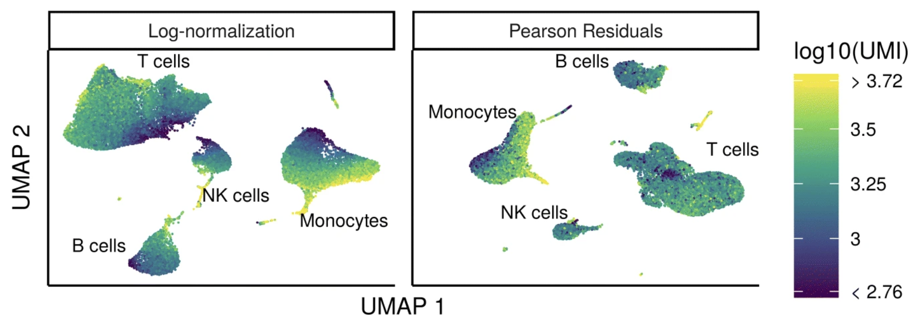

```{r}
#| label: load_libraries_data_R
#| echo: false
# Load libraries and data
library(Seurat)
library(tidyverse)
library(knitr)

filtered_seurat <- readRDS("intermediate/05_filtered_seurat.RDS")
```

```{python}
#| label: load_libraries_data_py
#| echo: false
# Load libraries and data
import scanpy as sc

filtered_adata = sc.read_h5ad("intermediate/05_filtered_adata.h5ad")
```

Approximate time: 90 minutes

## Learning objectives 

In this lesson, we will:

- Discuss why normalizing counts is necessary for accurate comparison between cells
- Describe different normalization approaches
- Evaluate the effects from any unwanted sources of variation and correct for them

## Overview of lesson

Now that we have our high quality cells, we can explore our data and see if we are able to identify any sources of unwanted variation. Depending on what we observe, we will utilize that information when performing different batch correction methods to remove the effect of these variables on our data.

::: {#fig-sc-workflow .figure}
{width=630}

Overview of the single-cell RNA-seq workflow.
:::


## Normalization

An essential first step in the majority of mRNA expression analyses is normalization, whereby systematic variations are adjusted for to **make expression counts comparable across genes and/or samples**. The counts of mapped reads for each gene is proportional to the expression of RNA ("interesting") in addition to many other factors ("uninteresting"). Normalization is the process of adjusting raw count values to account for the "uninteresting" factors. 

The main factors often considered during normalization are:
 
 - **Sequencing depth:** Accounting for sequencing depth is necessary for comparison of gene expression between cells. In the example below, each gene appears to have doubled in expression in cell 2, however this is a consequence of cell 2 having twice the sequencing depth. Each cell in scRNA-seq will have a differing number of reads associated with it. So to accurately compare expression between cells, it is necessary to normalize for sequencing depth.

::: {#fig-sequencing-depth .figure}
{width=400}

Effect of sequencing depth on observed gene expression counts between cells.
:::
 
 - **Gene length:** Accounting for gene length is necessary for comparing expression between different genes within the same cell. The number of reads mapped to a longer gene can appear to have equal count/expression as a shorter gene that is more highly expressed. 
 
::: {#fig-gene-length .figure}
{width=400}

Effect of gene length on observed read counts when comparing expression between genes.
:::

::: callout-note
# Droplet vs full-length sequencing normalization
If using a 3' or 5' droplet-based method, the length of the gene will not affect the analysis because only the 5' or 3' end of the transcript is sequenced. This dataset was sequenced using a 3' method, meaning it is not necessary to account for gene length.

However, if using full-length sequencing, the transcript length should be accounted for.
:::

### Log normalization

Various methods have been developed specifically for scRNA-seq normalization. Some **simpler methods resemble what we have seen with bulk RNA-seq**; the application of **global scale factors** adjusting for a count-depth relationship that is assumed common across all genes. However, if those assumptions are not true then this basic normalization can lead to over-correction for lowly and moderately expressed genes and, in some cases, under-normalization of highly expressed genes ([Bacher R et al, 2017](https://www.ncbi.nlm.nih.gov/pmc/articles/PMC5473255/)). **More complex methods will apply correction on a per-gene basis.** In this lesson we will explore both approaches.

Regardless of which method is used for normalization, it can be helpful to **think of it as a two-step process** (even though it is often described as a single step in most papers). The first is a scaling step and the second is a transformation.

**1. Scaling**

The first step in normalization is to **multiply each UMI count by a cell specific factor to get all cells to have the same UMI counts**. Why would we want to do this? Different cells have different amounts of mRNA; this could be due to differences between cell types or variation within the same cell type depending on how well the chemistry worked in one drop versus another. In either case, we are not interested in comparing these absolute counts between cells. Instead we are interested in comparing concentrations, and scaling helps achieve this.


**2. Transformation**

The next step is a transformation, and it is at this step where we can distinguish the simpler versus complex methods as mentioned above.

**Simple transformations** are those which apply the same function to each individual measurement. Common examples include a **log transform** (which is applied in the original workflow), or a square root transform (less commonly used).


::: {.panel-tabset group="language"}
## R

Let's start by creating a new script for the normalization and integration steps. Create a new script (File -> New File -> R script), and save it as `SCT_integration_analysis.R`.

For the remainder of the workflow we will be mainly using functions available in the Seurat package. Therefore, we need to load the Seurat library in addition to the tidyverse library and a few others listed below. 

```{r}
#| label: set-up_script
# Normalization and integration
# Introduction to scRNA-seq
# Author: Harvard Chan Bioinformatics Core
# Created: August 2026

# Load libraries
library(Seurat)
library(tidyverse)
library(cowplot)
```


The Seurat package will run both the scaling and transformation in a single step with the `NormalizeData()` function.

```{r}
#| label: normalize_data
# Normalize the counts
seurat_phase <- NormalizeData(filtered_seurat)
seurat_phase
```

When we print out the basic information about our Seurat object, we can see that we have a new `layer` called `data`. This is the counts matrix that holds our log-normalized counts.

## Python

Let's start by creating a new script for the normalization and integration steps. Create a new script titled `norm_and_integration.ipynb` and load the necessary libraries.

```{python}
#| label: set-up_script_py
# Normalization and integration
# Introduction to scRNA-seq
# Author: Harvard Chan Bioinformatics Core
# Created: August 2026

import scanpy as sc
import scvi

import seaborn as sns
import numpy as np
import pandas as pd
import matplotlib.pyplot as plt
```

Before we do any normalization, we want to ensure that the raw counts matrix is properly stores as a `layer`. By default, when we loaded in our dataset, the counts were stored to the `.X` slot of our object. So now we are going to store it in the `layers` slot under the name `counts` for easy reference in the future.

```{python}
#| label: copy_adata
# Create new adata object for normalized results
adata_phase = filtered_adata.copy()

# Saving count data
adata_phase.layers["counts"] = adata_phase.X.copy()
adata_phase
```

Within the scanpy library, we will make use of two different function for the scaling `pp.normalize_total()` and then transform with `pp.log1p()`. 

```{python}
#| label: normalize_data_py
# Normalizing to median total counts
adata_phase.layers["median"] = adata_phase.layers["counts"].copy()
sc.pp.normalize_total(adata_phase, layer = "median")

# Logarithmize the data
adata_phase.layers["log"] = adata_phase.layers["median"].copy()
sc.pp.log1p(adata_phase, layer = "log")

# Print adata information
adata_phase
```

So now we have three layers, each with the different counts matrices:

- counts
- median
- log

:::

## Highly variable genes

Highly variable gene selection is **extremely important** since many downstream steps are computed only on these genes. We calculate scores based upon how much a gene changes acrros the total populations of cells. Genes that vary a lot between populations will ranked more highly amongst all the genes.

We can additionally visualize the dispersion of all genes, which shows a gene's average expression across all cells on the x-axis and variance on the y-axis. Ideally we want to use genes that have high variance since this can indicate a change in expression depending on populations of cells. Adding labels helps us understand which genes will be driving shape of our data.


::: {.panel-tabset group="language"}
## R

```{r}
#| label: find_variable_genes
# Identify the most variable genes
seurat_phase <- FindVariableFeatures(seurat_phase, 
                     selection.method = "vst",
                     nfeatures = 2000, 
                     verbose = FALSE)

seurat_phase
```

::: callout-note
# `FindVariableFeatures` arguments
For the `selection.method` and `nfeatures` arguments the values specified are the default settings. Therefore, you do not necessarily need to include these in your code. We have included it here for transparency and inform you what you are using.
:::

Seurat allows us to access the ranked highly variable genes with the `VariableFeatures()` function. We can additionally visualize the dispersion of all genes using Seurat's `VariableFeaturePlot()`. To finish the visualization, we then label the top 15 genes.

```{r}
#| label: fig-top_15_variable_genes
#| fig-cap: Average expression and variance for each gene, labelling the top most variable genes.
# Identify the 15 most highly variable genes
ranked_variable_genes <- VariableFeatures(seurat_phase)
top_genes <- ranked_variable_genes[1:15]

# Plot the average expression and variance of these genes
# With labels to indicate which genes are in the top 15
p <- VariableFeaturePlot(seurat_phase)
LabelPoints(plot = p, points = top_genes, repel = TRUE)
```

## Python

Highly variable gene selection is extremely important since many downstream steps are computed only on these genes. Scanpy allows us to access the ranked highly variable genes with the `highly_variable_genes()` function. 

The parameters we are specifying refer to:

- `layer`: Which count matrix to use, if `.X` is not the matrix we want to use.
- `n_top_genes`: Number of highly-variable genes to keep.
- `batch_key`: If specified, highly-variable genes are selected within each batch separately and merged. This simple process avoids the selection of batch-specific genes and acts as a lightweight batch correction method.

```{python}
#| label: find_variable_genes_py
# Identify the most variable genes
sc.pp.highly_variable_genes(adata_phase, 
                            layer = "counts", 
                            flavor = "seurat_v3", 
                            n_top_genes = 2000, 
                            batch_key = "sample")
```

We can now see which genes are labeled as highly variable from the `.var` dataframe of our scanpy object. The new columns are:

- `highly_variable_rank`: Rank ordering of genes based on their variability
- `highly_variable`: True/False based on if the ranking is within the `n_top_genes`
- `means`: Average expression of the gene across all cells
- `variances`: Variance of the gene's expression across all cells
- `variances_norm`: Variance normalized for mean–variance dependence (dispersion) to compare genes with different means
- `highly_variable_nbatches`: Number of batches in which this gene was selected as highly variable (when `batch_key` is used)

```{python}
#| label: hvg_column_py
#| eval: false
# Show newly compute highly variable columns
adata_phase.var.head()
```

```{python}
#| label: tbl-hvg_column_py
#| tbl-cap: First several rows of a the `merged_adata.obs` to show the newly created `highly variable` column
#| echo: false
#| results: asis
print(adata_phase.var.head().to_markdown())
```

To visualize the variable genes we calculated, we can make use of the scanpy's `pl.highly_variable_genes()`.

```{python}
#| label: plot_hvgs_scanpy
# Default HVG figure
sc.pl.highly_variable_genes(adata_phase)
```

Alternatively, we can create our own custom plot to represent this data. Where we can visualize the dispersion of all genes, showing a gene's average expression across all cells on the x-axis and variance on the y-axis. Ideally we want to use genes that have high variance since this can indicate a change in expression depending on populations of cells. Adding labels using the `text()` helps us understand which genes will be driving shape of our data.

```{python}
#| label: fig-top_15_variable_genes_py
#| fig-cap: Average expression and variance for each gene, labelling the top most variable genes.
#| fig-width: 8
#| fig-height: 5
# Grab mean and variance for each gene
mean_expression = adata_phase.var["means"]
norm_variance = adata_phase.var["variances_norm"]

# Create a new canvas to plot on
fig, ax = plt.subplots(figsize = (5, 8), dpi = 150)

# Plot all genes in blue
sns.scatterplot(x = mean_expression,
                y = norm_variance,
                ax = ax,
                color = "blue",
                label = "All genes")

# Grab highly variable genes
# values that are True for `highly_variable`
hvg_mask = adata_phase.var["highly_variable"]

# Plot HVGs on top of original plot as red
sns.scatterplot(x = mean_expression[hvg_mask],
                y = norm_variance[hvg_mask],
                ax = ax,
                color = "red",
                label = "HVGs")

# Plot axes and titles
ax.set_xlabel("Mean Expression")
ax.set_ylabel("Normalized Variance")
ax.set_title("Mean Expression vs. Normalized Variance of Genes")
# log10 scale x-axis
ax.set_xscale("log")

# Grab top N genes
N = 15
top_genes = adata_phase.var["highly_variable_rank"].nsmallest(N).index

# Add text labels to figure
for gene_name in top_genes:
    x_value = mean_expression[gene_name]
    y_value = norm_variance[gene_name]
    ax.text(x_value, y_value, 
            gene_name, 
            fontsize = 8, color = "black")

# Show legend
plt.legend()
```


:::

Now, we can perform the PCA analysis on the highly variable genes that we just scored.


## PCA

Principal Component Analysis (PCA) is a technique used to emphasize variation as well as similarity, and to bring out strong patterns in a dataset; it is one of the methods used for *"dimensionality reduction"*. 

::: {.callout-note}
# PCA
For a more **detailed explanation on PCA**,  there is a [self-learning lesson](06_theory_of_PCA.qmd) outlining the method. We also strongly encourage you to explore the video [StatQuest's video](https://www.youtube.com/watch?v=_UVHneBUBW0) for a more thorough understanding.
:::

Let's say you are working with a single-cell RNA-seq dataset with *12,000 cells* and you have quantified the expression of *20,000 genes*. The schematic below demonstrates how you would go from a cell x gene matrix to principal component (PC) scores for each inividual cell.

::: {#fig-pca-schematic .figure}
{width=900}

Schematic of PCA: from a cell-by-gene count matrix to principal component scores per cell.
:::

After the PC scores have been calculated, you are looking at a matrix of 12,000 x 12,000 that represents the information about relative gene expression in all the cells. You can select the PC1 and PC2 columns and plot that in a 2D way.

::: {#fig-pca-pc1-pc2 .figure}
{width=600}

Example of visualizing cells using the first two principal components (PC1 vs PC2).
:::


::: {.callout-note}
# PC visualizations
For datasets with a larger number of cells, only the PC1 and PC2 scores for each cell are usually plotted, or used for visualization. Since these PCs explain the most variation in the dataset, the expectation is that the cells that are more similar to each other will cluster together with PC1 and PC2.
:::


::: {.panel-tabset group="language"}
## R

Since highly expressed genes exhibit the highest amount of variation and we don't want our _highly variable genes_ only to reflect high expression, we need to scale the data to scale variation with expression level. 

- Adjusting the expression of each gene to give a mean expression across cells to be 0
- Scaling expression of each gene to give a variance across cells to be 1

The Seurat `ScaleData()` function will do this scaling automatically.

```{r}
#| label: scaleData
# Scale the counts
seurat_phase <- ScaleData(seurat_phase)
seurat_phase
```

Notice is creates a new layer automatically called `scale.data`

Now, we can perform the PCA analysis with `RunPCA()` and plot the first two principal components against each other with `DimPlot()`.

```{r}
#| label: fig-run_pca
#| fig-cap: Cells plotted on PC1 vs PC2 and colored by sample.
# Perform PCA
seurat_phase <- RunPCA(seurat_phase)

# Plot the PCA colored by sample
DimPlot(seurat_phase,
        reduction = "pca",
        group.by = "sample")
```


## Python

To run PCA, we first want to set our `.X` default count matrix to be the log-normalized expression. Then, we use the `pp.pca()` function to compute the PCA scores for the first `n_comps` principal components. Additionally, we specify that only the expression from the top varaible genes should be used.

```{python}
#| label: calc_pca_show
#| eval: false
# Ensure log-normalized counts are in default .X slot
adata_phase.X = adata_phase.layers["log"].copy()

# Calculate PCA score
sc.pp.pca(adata_phase,
          n_comps = 50,
          mask_var = "highly_variable")
```

```{python}
#| label: calc_pca
#| eval: true
#| echo: false
# R and python installation of PCA colliding
# So I ran all the above code and then saved intermediate file
adata_phase = sc.read_h5ad("intermediate/07_adata_phase_pca.h5ad")
```

In running this function, we have create 2 new slots in our scanpy object. The `obsm` (observation matrices) and `varm` (variable/feature matrices).

```{python}
#| label: show_adata_phase
# Observe newly created obsm and varm slots
adata_phase
```

The `X_pca` contains the scores for each cell and Principal Component.

```{python}
#| label: show_pca
# First 5 PC score for first 5 cells in the dataset
adata_phase.obsm["X_pca"][1:5, 1:5]
```

Typically, the first 40 PCs are used for downstream analysis like clustering, marker identification etc., since these represent the majority of the variation in the data. We will be talking a lot more about this future lessons.

::: {#fig-pca-many-pcs .figure}
{width=600}

Using multiple principal components for downstream analyses such as clustering and marker identification.
:::

With these scores, we can plot how the cells lay on PC1 and PC2 with `pp.pca` where the `color` argument tells us which metadata column to color the cells by.

```{python}
#| label: fig-plot_pca_sample_py
#| fig-cap: Cells plotted on PC1 vs PC2 and colored by sample.
# PC1 vs PC2, colored by sample
sc.pl.pca(adata_phase, 
          color = "sample")
```

:::

We can clearly see that there is a split in our PC visualization based upon sample. Therefore, we know moving forward that we will have to integrate the samples together as there is technical noise causing our two datasets to not align well together (batch effect). Knowing this, we can also evaluate other metadata that could be contributing to the differences between samples.


## Batch effect

Oftentimes we need to apply corrections to ensure that sources of "uninteristing" variation are not introducing batch effects in our dataset. Here, we will to explore the data to identify if there are any variables that are introducing such effects in our dataset by making use of the PCA visualizations.


### Cell cycle

In single cell RNA-seq, one of the most common biological data corrections is the effects of the cell cycle on the trascriptome. So we will evaluate if this needs to be accounted for as we continue through the workflow.

::: callout-note
# Identify genes in each cell cycle phase
If you are not working with human data we have [additional materials](Aside_cell_cycle_scoring.qmd) detailing how to acquire cell cycle markers for other organisms of interest with R.
:::

::: {.panel-tabset group="language"}
## R

We have provided a list of human cell cycle markers for you in the `data` folder as an Rdata file called `cycle.rda`. 

This loads in 2 vectors `g2m_genes` and `s_genes` that contain genes that are known to have high expression in the different phases of the cell cycle.

```{r}
#| label: cell_cycle_genes
# Load cell cycle markers
load("data/additional_data/cycle.rda")

# preview s_genes
s_genes
```

To assign each cell a score based on its expression of G2/M and S phase markers, we can use the Seuart function `CellCycleScoring()`. This function calculates cell cycle phase scores based on canonical markers that required as input.

```{r}
#| label: cell_cycle_score
# Score cells for cell cycle
seurat_phase <- CellCycleScoring(seurat_phase, 
                                 g2m.features = g2m_genes, 
                                 s.features = s_genes)
```


Let's inspect our updated metadata:

```{r}
#| label: inspect_cell_cycle_scores
#| eval: false
# View cell cycle scores and phases assigned to cells
View(seurat_phase@meta.data)
```

```{r}
#| label: tbl-cell_cycle_scores
#| tbl-cap: "Inspecting that the cell cycle scores and phases have been appropriately added to our metadata."
#| echo: false
# View cell cycle scores and phases assigned to cells
seurat_phase@meta.data %>% 
  head(n = 5) %>% 
  remove_rownames() %>%
  relocate(cells) %>%
  knitr::kable()
```


## Python

```{python}
#| label: cell_cycle_genes_py
g2m_genes = [
    "NCAPD2", "ANLN", "TACC3", "HMMR", "GTSE1", "NDC80", "AURKA", "TPX2",
    "BIRC5", "G2E3", "CBX5", "RANGAP1", "CTCF", "CDCA3", "TTK", "SMC4",
    "ECT2", "CENPA", "CDC20", "NEK2", "CENPF", "TMPO", "HJURP", "CKS2",
    "DLGAP5", "PIMREG", "TOP2A", "PSRC1", "CDCA8", "CKAP2", "NUSAP1",
    "KIF23", "KIF11", "KIF20B", "CENPE", "GAS2L3", "KIF2C", "NUF2",
    "ANP32E", "LBR", "MKI67", "CCNB2", "CDC25C", "HMGB2", "CKAP2L",
    "BUB1", "CDK1", "CKS1B", "UBE2C", "CKAP5", "AURKB", "CDCA2",
    "TUBB4B", "JPT1"]

s_genes = [
    "UBR7", "RFC2", "RAD51", "MCM2", "TIPIN", "MCM6", "UNG", "POLD3",
    "WDR76", "CLSPN", "CDC45", "CDC6", "MSH2", "MCM5", "POLA1", "MCM4",
    "RAD51AP1", "GMNN", "RPA2", "CASP8AP2", "HELLS", "E2F8", "GINS2",
    "PCNA", "NASP", "BRIP1", "DSCC1", "DTL", "CDCA7", "CENPU", "ATAD2",
    "CHAF1B", "USP1", "SLBP", "RRM1", "FEN1", "RRM2", "EXO1", "CCNE2",
    "TYMS", "BLM", "PRIM1", "UHRF1"]
```

To assign each cell a score based on its expression of G2/M and S phase markers, we can use the function `tl.score_genes_cell_cycle()`. This function calculates cell cycle phase scores based on canonical markers that required as input.

```{python}
#| label: cell_cycle_score_py
# Cell cycle scoring
sc.tl.score_genes_cell_cycle(adata_phase, 
                             s_genes, 
                             g2m_genes)
```

Whenever we run a new function, it is a good idea to observer how our scanpy object changes. Since this is a score being calculated for each cell, we can take a look at the metadata to see which new columns have been generated.

In this case, we can see we have new column in our `.obs` dataframe:

- S_score
- G2M_score
- phase

```{python}
#| label: inspect_cell_cycle_scores_py
#| eval: false
# Observe newly created cell cycle columns
adata_phase.obs.head()
```

```{python}
#| label: tbl-cell_cycle_scores_py
#| tbl-cap: "Inspecting that the cell cycle scores and phases have been appropriately added to our metadata."
#| echo: false
#| results: asis
print(adata_phase.obs.head().to_markdown())
```

:::

After scoring the cells for cell cycle, we would like to **determine whether cell cycle is a major source of variation in our dataset using PCA**. 

::: callout-note
# When should cell cycle phase be regressed out?

Below are two PCA plots taken from the Seurat vignette dealing with [Cell-Cycle Scoring and Regression](https://satijalab.org/seurat/archive/v3.1/cell_cycle_vignette.html).

This first plot is similar to what we plotted above, it is a PCA prior to regression to evaluate if the cell cycle is playing a big role in driving PC1 and PC2. Clearly, the cells are separating by cell type in this case, so the vignette suggests regressing out these effects.


::: {#fig-cell-cycle-not-regressed .figure}
{width=400}

PCA colored by cell cycle phase before regression, illustrating strong separation driven by cell cycle.
_Image adapted from the Seurat [Cell-Cycle Scoring and Regression](https://satijalab.org/seurat/archive/v3.1/cell_cycle_vignette.html) vignette._
:::

This second PCA plot is **post-regression**, and displays how effective the regression was in removing the effect we observed.

::: {#fig-cell-cycle-regressed .figure}
{width=400}

PCA colored by cell cycle phase after regression, showing reduced separation by cell cycle.
_Image adapted from the Seurat [Cell-Cycle Scoring and Regression](https://satijalab.org/seurat/archive/v3.1/cell_cycle_vignette.html) vignette._
:::

:::

So now we can take a look at our own dataset to see if we should regress out `phase`.

::: {.panel-tabset group="language"}
## R

We once again plot PC1 vs PC2, but this time color (`group.by`) each of our cells by which phase of the cell cycle they belong to.

```{r}
#| label: fig-pca_cell_cycle
#| fig-cap: Cells plotted on PC1 vs PC2 and colored by cell cycle phase.
# Plot the PCA colored by cell cycle phase
DimPlot(seurat_phase,
        reduction = "pca",
        group.by= "Phase")
```

Another helpful way to visualize these different phase categories is to use the `split.by` argument to create multiple plots containing each of the unique values of `Phase`.

```{r}
#| label: fig-pca_cell_cycle_py
#| fig-cap: Cells plotted on PC1 vs PC2 and colored by cell cycle phase.
#| fig-width: 9
# Plot the PCA colored and split by cell cycle phase
DimPlot(seurat_phase,
        reduction = "pca",
        group.by= "Phase",
        split.by = "Phase")
```

We can see that each phase is well dispersed throughout the PCA space, indicating that we likely do not need to account for cell-cycle in future steps.


## Python

We once again plot PC1 vs PC2, but this time `color` each of our cells by which phase of the cell cycle they belong to.

```{python}
#| label: fig-plot_pca_phase_py
#| fig-cap: Cells plotted on PC1 vs PC2 and colored by cell cycle phase.
# PC1 vs PC2, colored by cell cycle phase
sc.pl.pca(adata_phase, 
          color = "phase")
```

To more clearly see the distribution for each phase, we can emphasize the `groups` and put the plots side-by-side as `subplots`.

```{python}
#| label: fig-pca_cell_cycle_split_py
#| fig-cap: Cells plotted on PC1 vs PC2 and colored by cell cycle phase.
# Create plot with the correct dimensions
fig, axes = plt.subplots(1, 3, figsize=(15, 5))

# Plot the PCA colored by cell cycle phase
sc.pl.pca(adata_phase, color = "phase", 
          groups = "G1", ax = axes[0], 
          show = False, title = "G1 Phase")
sc.pl.pca(adata_phase, color = "phase", 
          groups = "G2M", ax = axes[1], 
          show = False, title = "G2M Phase")
sc.pl.pca(adata_phase, color = "phase", 
          groups = "S", ax = axes[2], 
          show = False, title = "S Phase")

plt.tight_layout()
plt.show()
```

We can see that in the top right quadrant, most of the cells primarily belong to the G1 phase. This is an indication that we may need to account for cell-cycle in our future steps.

:::

If you are unsure whether or not to include or omit a variable from your analysis, **try testing both scenarios**! Testing different parameters and models is a great way to better understand your dataset.

### Mitochondrial ratio

Mitochondrial expression is another factor which can greatly influence clustering. Oftentimes, it is useful to regress out variation due to mitochondrial expression. However, if the differences in mitochondrial gene expression represent a biological phenomenon that may help to distinguish cell clusters, then we advise not regressing this out. In this exercise, we can perform a quick check similar to looking at cell cycle and decide whether or not we want to regress it out.

First, let us turn the mitochondrial ratio variable into a new categorical variable based on quartiles.

::: {.panel-tabset group="language"}
## R

```{r}
#| label: mito_ratio_wrangling
# Check quartile values
summary(seurat_phase@meta.data$mitoRatio)

# Turn mitoRatio into categorical factor vector based on quartile values
seurat_phase@meta.data$mitoFr <- cut(seurat_phase@meta.data$mitoRatio, 
                   breaks=c(-Inf, 0.0144, 0.0199, 0.0267, Inf), 
                   labels=c("Low", "Medium", "Medium high", "High"))
```

## Python

```{python}
#| label: mt_quartiles
# Calculate quartiles of mitochondrial ratio values
np.percentile(adata_phase.obs["pct_counts_mito"], 
              [0, 25, 50, 75, 100])
```

We then add categorical labels to cells based upon where they fall within the quartiles.

```{python}
#| label: mitoFr_calc
# Group cells into labels based upon mitochondrial ratio scores
adata_phase.obs["mitoFr"] = pd.cut(
    adata_phase.obs["pct_counts_mito"],
    bins = [-np.inf, 1.44, 1.99, 2.67, np.inf],
    labels = ["Low", "Medium", "Medium high", "High"])
```

:::


:::{.callout-tip}
# [**Exercise 1**](07_normalization-Answer_key.qmd#exercise-1)
1. Next, plot the PCA similar to how we did with cell cycle regression. *Hint: use the new `mitoFr`variable to split cells and color them accordingly.*
2. Evaluate the PCA plot generated:

	- Determine whether or not you observe an effect.
	- Describe what you see. 
	- Would you regress out mitochondrial fraction as a source of unwanted variation?

:::

## SCTransform

In the [Hafemeister and Satija, 2019 paper](https://genomebiology.biomedcentral.com/articles/10.1186/s13059-019-1874-1) the authors explored the issues with simple transformations. Specifically they evaluated the standard log normalization approach and found that genes with different abundances are affected differently and that **effective normalization (using the log transform) is only observed with low/medium abundance genes (Figure 1D, below)**. Additionally, **substantial imbalances in variance were observed with the log-normalized data (Figure 1E, below)**. In particular, cells with low total UMI counts exhibited disproportionately higher variance for high-abundance genes, dampening the variance contribution from other gene abundances.

::: {#fig-sct-fig1 .figure}
{width=600}

Illustration of the limitations of simple log normalization and resulting variance imbalances in scRNA-seq data.<br>
_Source: [Hafemeister & Satija, 2019](https://doi.org/10.1101/576827)_
:::

The conclusion is, **we cannot treat all genes the same.**

The proposed solution was the use of **Pearson residuals for transformation**, as implemented in Seurat's `SCTransform` function. With this approach:

- Measurements are multiplied by a gene-specific weight
- Each gene is weighted based on how much evidence there is that it is non-uniformly expressed across cells
- More evidence == more of a weight; Genes that are expressed in only a small fraction of cells will be favored (useful for finding rare cell populations)
- Not just a consideration of the expression level is, but also the distribution of expression

::: callout-note
# Why don't we just run SCTransform to normalize?
While the functions `NormalizeData`, `VariableFeatures` and `ScaleData` can be replaced by the function `SCTransform`, the latter uses a more sophisticated way to perform the normalization and scaling. We suggest using log normalization because it is good to observe the data and any trends using a simple transformation, as methods like SCT can alter the data in a way that is not as intuitive to interpret. 
:::

Now that we have established which effects are observed in our data, we can use the SCTransform method to regress out these effects. The **SCTransform** method was proposed as a better alternative to the log transform normalization method that we used for exploring sources of unwanted variation. The method not only **normalizes data, but it also performs a variance stabilization and allows for additional covariates to be regressed out**.

As described earlier, all genes cannot be treated the same. As such, the **SCTransform method constructs a generalized linear model (GLM) for each gene** with UMI counts as the response and sequencing depth as the explanatory variable. Information is pooled across genes with similar abundances, to regularize parameter estimates and **obtain residuals which represent effectively normalized data values** which are no longer correlated with sequencing depth.

::: {#fig-sct-umap .figure}
{width=550}

Example UMAP visualization demonstrating improved normalization and variance stabilization with SCTransform.<br>
_Source: [Hafemeister & Satija, 2019](https://doi.org/10.1101/576827)_
:::


::: callout-note
# Regressing out covariates
Since the UMI counts are part of the GLM, the effects are automatically regressed out. The user can include any additional covariates (`vars.to.regress`) that may have an effect on expression and will be included in the model. 
:::


::: {.panel-tabset group="language"}
## R

To run the SCTransform we have the code below as an example. **Do not run this code**, as we prefer to run this for each sample separately in the next section below.


```{r}
#| label: SCTransform_example
#| eval: false
## DO NOT RUN CODE ##

# SCTransform
seurat_phase <- SCTransform(seurat_phase, 
                            vars.to.regress = c("mitoRatio"))
```

### Iterating over samples in a dataset

Since we have two samples in our dataset (from two conditions), we want to keep them as separate objects and transform them as that is what is required for integration. We will first split the cells in `seurat_phase` object into "Control" and "Stimulated":

```{r}
#| label: split_seurat_object
# Split seurat object by condition to perform cell cycle scoring and SCT on all samples
split_seurat <- SplitObject(seurat_phase, split.by = "sample")
split_seurat
```

::: callout-note
# Subsetting samples
If you only wanted to integrate on a subset of your samples (e.g. all Ctrl replicates only), you could select which ones you wanted from the `split_seurat` object as shown below and move forward with those.

```{r}
#| label: split_seurat_subset_example
#| eval: false
## DO NOT RUN
ctrl_reps <- split_seurat[c("ctrl_1", "ctrl_2")]
```
:::

Now we will **use a `for` loop** to run the `SCTransform()` on each sample, and regress out mitochondrial expression by specifying in the `vars.to.regress` argument of the `SCTransform()` function.

Before we run this `for loop`, we know that the output can generate large R objects/variables in terms of memory. If we have a large dataset, then we might need to **adjust the limit for allowable object sizes within R** (*Default is 500 x 1024 ^2 = 500 Mb*) using the following code:

```{r}
#| label: increase_memory
options(future.globals.maxSize = 4000 * 1024^2)
```

Now, we run the following loop to **perform the SCTransform on all samples**. This may take some time (~10 minutes):

```{r}
#| label: SCTransform_all_samples
#| eval: false
for (i in 1:length(split_seurat)) {
    split_seurat[[i]] <- SCTransform(split_seurat[[i]], 
                                     vars.to.regress = c("mitoRatio"),
                                     vst.flavor = "v2")
    }
```

```{r}
#| label: load_SCTransform_all_samples
split_seurat <- readRDS("intermediate/07_split_seurat.RDS")
```

Please note that in the for loop above, we specify that `vst.flavor = "v2"` to use the updated version of SCT. "v2" was introduced in early 2022, and is now commonly used. This update improves:

- Speed and memory consumption
- The stability of parameter estimates
- Variable feature identification in subsequent steps

For more information, please see the [Seurat vignette's section on SCTransform, v2 regularization](https://satijalab.org/seurat/articles/sctransform_v2_vignette.html). 

::: callout-note
# SCTransform variable features
By default, after normalizing, adjusting the variance, and regressing out uninteresting sources of variation, SCTransform will rank the genes by residual variance and output the 3,000 most variant genes. If the dataset has larger cell numbers, then it may be beneficial to adjust this parameter higher using the `variable.features.n` argument.
:::

Note, the last line of output specifies **"Set default assay to SCT"**. This specifies that moving forward we would like to use the data after SCT was implemented. We can view the different assays that we have stored in our seurat object.

```{r}
#| label: check_assays
# Check which assays are stored in objects
split_seurat$ctrl@assays
```

Now we can see that in addition to the raw RNA counts, we now have a SCT component in our `assays` slot. The most variable features will be the only genes stored inside the SCT assay. As we move through the scRNA-seq analysis, we will choose the most appropriate assay to use for the different steps in the analysis. 

::: callout-tip
# [**Exercise 2**](07_normalization-Answer_key.qmd#exercise-2)

3. Are the same assays available for the "stim" samples within the `split_seurat` object? What is the code you used to check that?

4. Any observations for the genes or features listed under *"First 10 features:"* and the *"Top 10 variable features:"* for "ctrl" versus "stim"?
:::

## Python

The scanpy workflow does not have the exact `SCTranform` algorithm built into its workfow. However, there is an analagous [Analytic Pearson Residuals](https://www.sc-best-practices.org/preprocessing_visualization/normalization.html#analytic-pearson-residuals) normalization that follows the same logic. 

We will be following an alternative method to deal with integration and batch correction in the next lesson. The technique we will used is called SCVI and does not require the output of this normalization step.

:::

## Save the object

Before finishing up, let's save this object to the `data/` folder. It can take a while to get back to this stage especially when working with large datasets, it is best practice to save the object as an easily loadable file locally.

::: {.panel-tabset group="language"}
## R

```{r}
#| label: save_seurat_object
#| eval: false
# Save the split seurat object
saveRDS(split_seurat, "data/split_seurat.rds")
```

::: callout-note
# Loading dataset
To load the `.rds` file back into your environment you would use the following code:

```{r}
#| label: load_seurat_object_example
#| eval: false
## DO NOT RUN
# Load the split seurat object into the environment
split_seurat <- readRDS("data/split_seurat.rds")
```

:::

## Python

```{python}
#| label: save_adata_object
#| eval: false
adata_phase.write_h5ad("data/adata_phase.h5ad")
```

::: callout-note
# Loading dataset
To load the `.h5ad` file back into your environment you would use the following code:

```{r}
#| label: load_adata_object_example
#| eval: false
## DO NOT RUN
# Load the split seurat object into the environment
adata = sc.read_h5ad("data/adata_phase.h5ad")
```
:::

:::


```{r}
#| label: instructor_save
#| eval: false
#| echo: false
saveRDS(split_seurat, "intermediate/07_split_seurat.RDS")
saveRDS(seurat_phase, "intermediate/07_seurat_phase.RDS")
```

```{python}
#| label: instructor_save_py
#| eval: false
#| echo: false
adata_phase.write_h5ad("intermediate/07_adata_phase.h5ad")
```

***

[Next Lesson >>](08_integration_theory.qmd)

[Back to Schedule](../schedule/schedule.qmd)