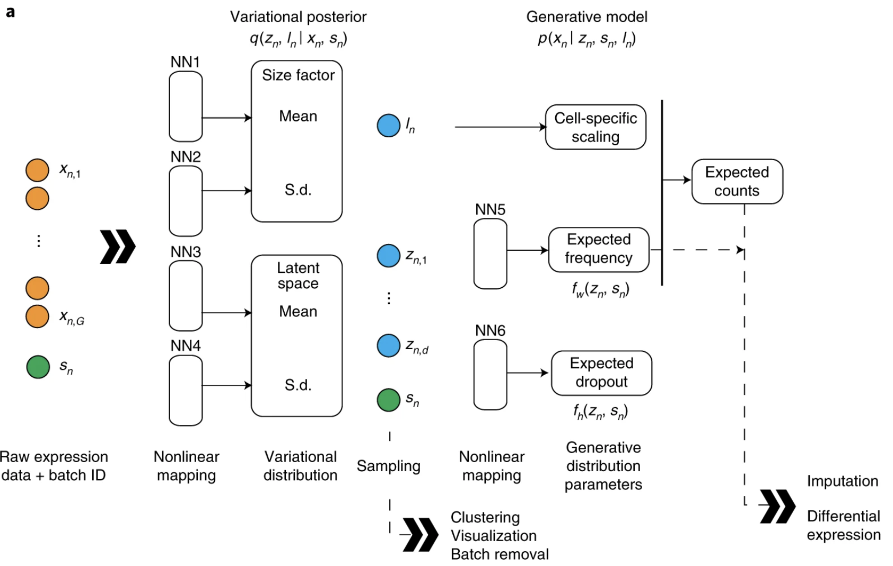

```{r}
#| label: load_libraries_data_R
#| echo: false
# Load libraries and data
# Load libraries
library(Seurat)
seurat_phase <- readRDS("intermediate/07_seurat_phase.RDS")
```

```{python}
#| label: load_libraries_data_py
#| echo: false
# Load libraries and data
import scanpy as sc
adata_phase = sc.read_h5ad("intermediate/07_adata_phase.h5ad")
```

Approximate time: 90 minutes

## Learning objectives 

In this lesson, we will:

- Describe when integration is necessary
- Integration using either CCA or scVI to control for batch effect
- Plot UMAP representation of the cells

## Overview of lesson

At this point in the analysis, we want to move onto the next step of annotating cells that are similar to one another (cell types). However, sometimes a detour is necessary to address technical effects due to differences between between samples, conditions, modalities, or batches. In these cases, differences caused by unwanted variation may cause similar cells to be dissimilar. This **integration** is sometimes necessary in order to proceed with the analysis, but is not always required.

::: {#fig-sc-workflow .figure}
{width=630}

Overview of the single-cell RNA-seq workflow.
:::

## To integrate or not to integrate?

Generally, we always look at our clustering **without integration** before deciding whether we need to perform any alignment. It can be helpful to first run through clustering with samples from different sample classes together to see whether there are condition-specific clusters for cell types present in both conditions. Oftentimes, when clustering cells from multiple conditions there are condition-specific clusters and integration can help ensure the same cell types cluster together.

**Do not just always perform integration because you think there might be differences - explore the data.** If we had performed the normalization on both conditions together in a Seurat object and visualized the similarity between cells, we would have seen in our dataset there is condition-specific clustering.
 

Condition-specific clustering of the cells indicates that we need to integrate the cells across conditions to ensure that cells of the same cell type cluster together. If cells cluster by sample, condition, batch, dataset, modality, performing integration can help align cells across the groups to greatly improve the clustering and the downstream analyses.


### Examples scenarios for integration

- Different **conditions** (e.g. control and stimulated)

::: {#fig-integration-conditions .figure}
{width=60%}

Example of condition-specific clustering and post-integration alignment using Seurat (control vs stimulated).
:::

- Different **datasets** (e.g. scRNA-seq from datasets generated using different library preparation methods on the same samples)

::: {#fig-integration-datasets .figure}
{width=60%}

Example of integrating multiple scRNA-seq datasets generated with different library preparation methods.
:::

- Different **batches** (e.g. when experimental conditions make batch processing of samples necessary)

**Why is it important that cells of the same cell type cluster together?** 

We want to identify  _**cell states that are present in all samples/conditions/modalities**_ within our dataset, and therefore would like to observe a representation of cells from both samples/conditions/modalities in every cluster. This will enable more interpretable results downstream (i.e. DE analysis, ligand-receptor analysis, differential abundance analysis...).


### Integration in our dataset

So then how would you determine if integration is necessary? 

One way is to return to our PCA embedding, where we noted that there was a clear divide amongst our cells based upon the `sample` condition - our only batch variable.

::: {.panel-tabset group="language"}
## R

```{r}
#| label: fig-PCA_sample_plot
#| fig-cap: Sample-specific clustering in PCA space, before integration.
# Plot PCA colored by sample
DimPlot(seurat_phase,
        reduction = "pca",
        group.by = "sample")
```


## Python

```{python}
#| label: fig-PCA_sample_plot_py
#| fig-cap: Sample-specific clustering in PCA space, before integration.
# Plot PCA colored by sample
sc.pl.pca(adata_phase,
           color="sample")
```

:::

In this dataset, we know that the gene `LYZ` is a marker for monocytes. Even if the monocyte populations differ slightly between experimental conditions, we still expect monoctyes from all batches to be biologically similar. Because of this, these cells should be considered comparable and should occupy the same region in the PCA embedding.

::: {.panel-tabset group="language"}
## R

```{r}
#| label: fig-lyz_featureplot
#| fig-cap: Expression of gene LYZ on the unintegrated PCA to show when integration is necessary.
# Plot sample on PCA space
p_sample <- DimPlot(seurat_phase,
                    reduction = "pca",
                    group.by = "sample")

# Plot LYZ expression on PCA space
p_lyz <- FeaturePlot(seurat_phase,
                     reduction = "pca",
                     features = "LYZ")

p_sample + p_lyz
```

In this lesson, we will cover the integration of our samples across conditions, which is adapted from the [Seurat Guided Integration Tutorial](https://satijalab.org/seurat/articles/integration_introduction.html).

::: callout-note
# Vignette without integration
Seurat has a [vignette](https://satijalab.org/seurat/articles/sctransform_vignette.html) for how to run through the workflow from normalization to clustering without integration. Other steps in the workflow remain fairly similar, but the samples would not necessarily be split in the beginning and integration would not be performed.
:::

## Python

```{python}
#| label: fig-lyz_featureplot_py
#| fig-cap: Expression of gene LYZ on the unintegrated PCA to show when integration is necessary.
# Plot sample and LYZ expression on PCA space
sc.pl.embedding(adata_phase, 
                color=["sample", "LYZ"], 
                basis="pca")
```

:::

We can clearly see that there is a split in the grouping of monocytes that is driven by batch (sample).

## Integration methods

There are [many different integration](https://www.scrna-tools.org/tools?sort=name&cats=Integration) methods that can be used to align single-cell RNA-seq datasets together. Some of the most popular methods include canonical correlation analysis (CCA) (Seurat based), single-cell Variational Inference (scVI) (scanpy based), and harmony. Here, we will discuss the underpinning logic of each method, before applying them practically in the next lesson.

::: callout-important
# Start with method for your programming language
**This text is quite dense, so we recommend focusing on the method that suits the programming language you are working in first. scVI for python and CCA for R.**
:::

### Canonical Correlation Analysis (CCA) (Seurat)

Integration is a powerful method that **uses shared highly variable genes from each group to identify shared subpopulations across conditions or datasets** [[Stuart and Bulter et al. (2018)](https://www.biorxiv.org/content/early/2018/11/02/460147)]. The goal of integration is to ensure that the cell types of one condition/dataset align with the same celltypes of the other conditions/datasets (e.g. control macrophages align with stimulated macrophages).

The integration method that is available in the Seurat package utilizes the **canonical correlation analysis** (CCA); a method that expects "correspondences" or shared biological states among at least a subset of single cells across the groups. The result of this integration approach is a corrected data matrix for all datasets, enabling them to be analyzed jointly in a single workflow. To transfer information from a reference to query dataset, Seurat **does not modify the underlying expression data, but instead projects continuous data across experiments**.

The steps in the `Seurat` integration workflow are outlined in the figure below:

::: {#fig-integration-workflow .figure}


Overview of the Seurat integration workflow using canonical correlation analysis (CCA) and anchors.
_Source: [Stuart & Butler et al., 2018](https://doi.org/10.1101/460147)_
:::


**1. Identify shared variable genes**:

Integration aims to take the matrix for each dataset (Ctrl and Stim) and identify correlated structures across them and align them in a common space. The **shared highly 
variable genes from each dataset are used to form the intersection set**, because they are the most likely to represent those genes distinguishing the different cell types present.

_Each dataset can have a different number of cells, but must have the same number of genes._


**2. Perform canonical correlation analysis (CCA):**
	
Next, Seurat will jointly reduce the dimensionality of both datasets using diagonalized canonical correlation analysis (CCA) which is a form of PCA. Similar to principal components in PCA, the CCA will result in canonical correlation vectors. An L2-normalization is applied to the canonical correlation vectors, to use as input for the next step (identifying MNNs).


**3. Find mutual nearest neighbors (MNNs) or anchors:**

In this new shared low-dimensional space, Seurat will identify anchors or mutual nearest neighbors (MNNs) across datasets. These MNNs are pairs of cells that can be thought of as **'best buddies'**.

For each cell in one condition:

- The cell's closest neighbor in the other condition is identified based on gene expression values - its 'best buddy'.
- The reciprocal analysis is performed, and if the two cells are 'best buddies' in both directions, then those cells will be marked as **anchors** to 'anchor' the two datasets together.
	

**4. Filter anchors** to remove incorrect anchors:
	
Assess the similarity between anchor pairs by the overlap in their local neighborhoods (incorrect anchors will have low scores) - do the adjacent cells have 'best buddies' that are adjacent to each other? If not, these are removed the anchor list.

**5. Integrate the conditions/datasets**:

Using the anchors and corresponding scores the cell expression values are transformed, allowing for the integration of the conditions/datasets (different samples, conditions, datasets, modalities). For each cell in the dataset we now have an integrated value, but only for the variable features used for this analysis.

::: callout-note
# Neighborhoods and correction values
Transformation of each cell uses a weighted average of the two cells of each anchor across anchors of the datasets. Weights determined by cell similarity score (distance between cell and k nearest anchors) and anchor scores, so cells in the same neighborhood should have similar correction values.
:::

**If cell types are present in one dataset, but not the other, then the cells will still appear as a separate sample-specific cluster.**

::: callout-note
# Reciprocal PCA
If there are a substantial number of cells that do not have a match between groups or there are a large number of cells to integrate, an alternative approach recommended by the Seurat vignette is [reciprocal PCA (RPCA)](https://satijalab.org/seurat/articles/integration_rpca.html).
:::

### single-cell Variational Inference (scVI) (scanpy)

TODO: edit

scVI is a neural-newtork based method that was published in [2018 by Lopez et. al](https://www.nature.com/articles/s41592-018-0229-2) to reduce technical noise.

::: {#fig-scvi_schematic .figure}
{width=60%}

Schematic of the scVI algorithm.<br>
_Image source: [Lopez et al. (2018)](https://www.nature.com/articles/s41592-018-0229-2)_
:::

> You tell scVI which cells belong to which sample, choose a 2‑dimensional latent space, train the model so that a 2D vector plus the batch can reconstruct each cell’s counts, and then take those 2D vectors as your new batch‑corrected embedding.


1. We assume that there is a batch-corrected latent space (`X`) that we can map our cells to. This is simlar to how we flattened our cells into 2 principal components from our entire counts matrix.
2. Given a batch variable (`sample`) and `total_counts`, genes are modelled as a zero-inflated negative binomial distribution.

_If I know a cell's latent representation and batch, I can generate its gene expression profile._

3. Create a decoder neural network that takes in the latent space and batch label to generate a parameter for **each gene**.
4. Use an encoder neural network to take the _actual_ counts and its batch label to create a distribution over the latent space for each cell.
5. Run multiple iteration of encoder and decoder to optimize parameters, where:

  - counts -> `X` (encoder)
  - `X` + batch → counts (decoder)

6. Use the posterior mean of `X` distribution as each cell's latent space coordinates.

***

[Next Lesson >>](09_integration_code_harmony.qmd)

[Back to Schedule](../schedule/schedule.qmd)