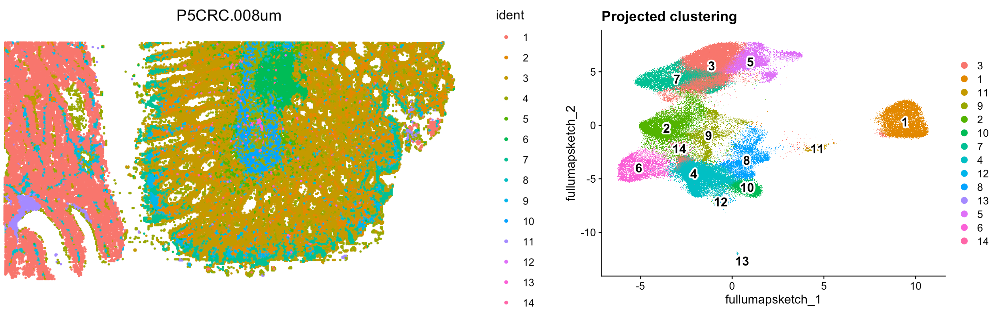

```{r}
#| label: load_libraries_data_R
#| echo: false
# Load libraries and data
library(Seurat)
library(tidyverse)
library(dplyr)
library(cowplot)

# Load data
# seurat_integrated <- readRDS("intermediate/09_seurat_integrated.RDS")
seurat_integrated <- readRDS("data/additional_data/seurat_integrated.rds")

# Set randomness
set.seed(1234)
```

```{python}
#| label: load_libraries_data_py
#| echo: false
# Load libraries
import scanpy as sc
import numpy as np

# Load data
# adata_integrated = sc.read_h5ad("intermediate/09_adata_integrated.h5ad")
adata_integrated = sc.read_h5ad("data/additional_data/adata_integrated.h5ad")

# Set randomness
np.random.seed(1234)
```

Approximate time: 90 minutes

## Learning objectives 

In this lesson, we will:

- Evaluate an appropriate number of principal components to use for clustering.
- Leverage integrated latent space to calculate UMAP coordinates.
- Identify nearest neighbors to create clusters of cells.

## Overview of lesson

Now that we have our high quality cells integrated, we want to know the different cell types present within our population of cells. To this end, our next steps will be to identify similarity between our cells using networks. With this representation, we can run clustering and UMAP algorithms to represent transcriptionally unique populations of cells in our dataset.

::: {#fig-sc-workflow .figure}
{width=630}

Overview of the single-cell RNA-seq workflow.
:::

## Principal component selection

Before starting with this lesson, let's create a new script for the next few steps. We are also going to "set our seed", which is assigning a fixed value for randomness to allow for reproducible results as many of the algorithms in this lesson utilize random sampling in their algorithms.

::: callout-note
# Setting seed
Typically, the seed would be placed at the beginning of your script. In this way the selected random number would be applied to any function that uses pseudorandom numbers in its algorithm.
:::


::: {.panel-tabset group="language"}
## R

Create a new script titled `clustering.R`. 

```{r}
#| label: header
#| eval: false
# Clustering
# Introduction to single-cell RNA-seq workshop
# Author: Harvard Chan Bioinformatics Core
# August 2026

# Load libraries
library(Seurat)
library(tidyverse)
library(dplyr)

# Load data
seurat_integrated <- readRDS("data/seurat_integrated.rds")

# Set randomness
set.seed(1234)
```

## Python

Create a new notebook titled `clustering.ipynb`

```{python}
#| label: header_py
#| eval: false
# Clustering
# Introduction to single-cell RNA-seq workshop
# Author: Harvard Chan Bioinformatics Core
# August 2026

# Load libraries
import scanpy as sc
import numpy as np
import seaborn as sns
import matplotlib.pyplot as plt

# Load data
adata_integrated = sc.read_h5ad("data/adata_integrated.h5ad")

# Set randomness
np.random.seed(1234)
```

:::

To overcome the extensive technical noise in the expression of any single gene for scRNA-seq data, **Seurat assigns cells to clusters based on their PCA scores derived from the expression of the integrated most variable genes**, with each PC essentially representing a "metagene" that combines information across a correlated gene set. **Determining how many PCs to include in the clustering step is therefore important to ensure that we are capturing the majority of the variation**, or cell types, present in our dataset. 

It is useful to explore the PCs prior to deciding which PCs to include for the downstream clustering analysis.

### Identifying significant PCs

One way of exploring the PCs is using a heatmap to visualize the most variant genes for select PCs with the **genes and cells ordered by PCA scores**. The idea here is to look at the PCs and determine whether the genes driving them make sense for differentiating the different cell types. 

We are looking for a PC where the heatmap starts to look more "fuzzy", i.e. where the distinctions between the groups of genes is not so distinct.

::: {.panel-tabset group="language"}
## R

The `cells` argument for `DimHeatmap()` specifies the number of cells with the most negative or positive PCA scores to use for the plotting. 

```{r}
#| label: fig-integrated_DimHeatmap
#| fig-cap: Heatmap of the first 9 principal components, showing expression across 500 cells for the top genes (negative and positive) for the component.
# Explore heatmap of PCs
DimHeatmap(seurat_integrated, 
           dims = 1:9,
           cells = 500,
           balanced = TRUE)
```

## Python

These types of figures are subjective and cannot show a summary of many principal components all at once.

```{r}
#| label: fig-integrated_DimHeatmap_py
#| echo: false
#| fig-cap: Heatmap of the first 9 principal components, showing expression across 500 cells for the top genes (negative and positive) for the component.
# Explore heatmap of PCs
DimHeatmap(seurat_integrated, 
           dims = 1:9,
           cells = 500,
           balanced = TRUE)
```

:::

This method can be slow and hard to visualize individual genes if we would like to explore a large number of PCs. In the same vein and to explore a large number of PCs, we could print out the top 10 (or more) positive and negative genes by PCA scores driving the PCs.

::: {.panel-tabset group="language"}
## R

```{r}
#| label: genes_driving_PCs
# Printing out the most variable genes driving PCs
print(x = seurat_integrated[["pca"]],
      dims = 1:10,
      nfeatures = 5)
```

## Python

```{python}
#| label: fig-pca_loadings
#| fig-cap: Ranking of top genes in the first 3 principal components, showing the top and bottom genes.
# Print top and bottom ranked genes for first 3 PCs
sc.pl.pca_loadings(adata_integrated,
                   components = "1,2,3")
```

:::

The **elbow plot** is another helpful way to determine how many PCs to use for clustering so that we are capturing majority of the variation in the data. The elbow plot visualizes the standard deviation of each PC, and we are looking for where the standard deviations begins to plateau. Essentially, **where the elbow appears is usually the threshold for identifying the majority of the variation**. However, this method can be quite subjective. 

Let's draw an elbow plot using the top 40 PCs:

::: {.panel-tabset group="language"}
## R

```{r}
#| label: fig-PC_elbow_plot
#| fig-cap: Plot showing the standard deviation represented with each component to determine a cutoff value for the number of PCs.
# Elbow plot visualization
ElbowPlot(object = seurat_integrated, 
          ndims = 40)
```

::: callout-note
# Why is selection of PCs more important for older methods?
The older methods incorporated some technical sources of variation into some of the higher PCs, so selection of PCs was more important. SCTransform estimates the variance better and does not frequently include these sources of technical variation in the higher PCs. 
 
In theory, with SCTransform, the more PCs we choose the more variation is accounted for when performing the clustering, but it takes a lot longer to perform the clustering. Therefore for this analysis, we will use the **first 40 PCs** to generate the clusters. 
:::

## Python

```{python}
#| label: fig-PC_elbow_plot_py
#| fig-cap: Plot showing the standard deviation represented with each component to determine a cutoff value for the number of PCs.
# Elbow plot visualization
sc.pl.pca_variance_ratio(adata_integrated, 
                         n_pcs = 50, log = True)
```

:::

Based on this plot, we could roughly determine the majority of the variation by where the elbow occurs around PC8 - PC10, or one could argue that it should be when the data points start to get close to the X-axis, PC30 or so. This gives us a very rough idea of the number of PCs needed to be included, we can extract the information visualized here in a [**more quantitative manner**](Aside_elbow_plot_metric.qmd), which may be a bit more reliable.  


## k-nearest neighbors (kNN)

Now, we want to group similar cells (cell states) together based upon their gene expression profiles with clustering. This is a two-step process that involves:

1. Constructing a K-nearest neighbor (KNN) graph based on the PCA space.
2. Group cells together based upon the KNN graph to assign cluster labels to each cell.

This graph-based approach allows us to partition the graph of cells into highly interconnected ‘quasi-cliques’ or ‘communities’ that represent clusters of similar cells. A nice in-depth description of clustering methods is provided in the [SVI Bioinformatics and Cellular Genomics Lab course](https://biocellgen-public.svi.edu.au/mig_2019_scrnaseq-workshop/clustering-and-cell-annotation.html).

### kNN steps

The first step is to **construct a K-nearest neighbor (KNN) graph**. As previously mentioned, this is calculated on the PCA space. Recall that we have multiple principal components (PCs) with scores for each one of our cells. We can think of the steps taken like so:

::: {#fig-k_means .figure}
{width=500}

Schematic showing how cells are connected in PCA space, where edges connected between close cells are then used to calculate edge weights based upon the shared overlap in their local neighborhoods.<br>
_Image source: [Analysis of Single cell RNA-seq data](https://biocellgen-public.svi.edu.au/mig_2019_scrnaseq-workshop/clustering-and-cell-annotation.html)_.
:::

1. Each cell is a point in latent/PCA (n-dimensional) space.
2. We calculate the distance (euclidean) between each cell and all other cells in this latent/PCA space.
3. We then connect cells together (edges) that are close to each other. Cells that are close together in latent/PCA space will have similar gene expression profiles, and thus are likely to be similar.
4. To further confirm the similarity of cells, we ask, _do these two cells also share nearby neighbors (cells)?_ These shared neighbors are an additional layer of confirmation that cell A and cell B are similar to one another if they are connected to the same cells (neighbors). We use this to recalculate the edge weights between cells, **creating a shared nearest neighbor (SNN) graph**.

This means that if two cells are close together in PCA space and have similar neighbors, they will have a stronger connection (higher edge weight) than two cells that are close together but do not share similar neighbors.

::: {.panel-tabset group="language"}
## R

All of this is done in one step with the Seurat function `FindNeighbors()`. The `FindNeighbors()` function takes in the PCA reduction and calculates the KNN graph. We specify the `reduction` (sketch) as well as which components (`dims`) will be used for the calculation. In this case, we will be using the first 40 PCs.

```{r}
#| label: FindNeighbors
#| eval: false
# Determine the K-nearest neighbor graph
seurat_integrated <- FindNeighbors(seurat_integrated,
                                   dims = 1:40)
```

We should now see two graphs in the `@graphs` slot of `seurat_integrated`. The first in the list is the KNN graph (`integrated_nn`) and the second is the shared nearest neighbor (SNN) graph (`integrated_snn`).

```{r}
#| label: print_seurat_graphs
seurat_integrated@graphs
```

We use the SNN graph because it considers both the distance between two cells and the similarity of their local neighborhoods. This leads to more robust and biologically meaningful connections between cells. In contrast, the KNN graph only considers the distance between two cells, which may not capture the full complexity of the global relationships between many cells at once.


## Python

kNN are calculated in one step with the `sc.pp.neighbors()` function. Importantly, we must specify the `use_rep` argument to be the integrated `X_scvi` latent space that was computed in the previous lesson.

```{python}
#| label: calc_neighbors
#| eval: false
# Calculate neighbors
sc.pp.neighbors(adata_integrated, 
                use_rep = "X_scvi", 
                key_added = "scvi",
                random_state = 1234)
```

We specified `key_added` as "scvi" so that we do not overwrite any previous neighborhoods that may have been calculated. This can more clearly be seen when we look at the `obsp` slot of our adata object.

```{python}
#| label: show_adata
# Print new obsp slot where neighbors are stored
adata_integrated.obsp
```

:::

Now that we have this shared nearest neighbor graph, we can begin the clustering and UMAP steps.

## UMAP

To visualize the cells, there are a few additional [dimensionality reduction techniques](https://www.nature.com/articles/s41598-025-14301-8) beyond PCA that can be helpful. The most popular methods include:

- t-distributed stochastic neighbor embedding: [t-SNE](https://www.nature.com/articles/s41467-019-13056-x)
- Uniform manifold approximation and projection: [UMAP](https://www.scdiscoveries.com/blog/knowledge/what-is-a-umap-plot/)
- Singular value decomposition: [SVD](https://pmc.ncbi.nlm.nih.gov/articles/PMC12753137/)

::: {.callout-note collapse="true"}
# UMAP vs t-SNE vs SVD

Both UMAP and t-SNE are built under the same general structure of taking a larger dimensional space (PCA) and flattening it to two dimensions using manifolds. UMAP has come out on top between the two due its ability to balance both local and global structures of the dataset. Additionally, it is less sensitive to parameter choice, making it easier to tune. In contrast, the output of t-SNE plots tend to emphasize the local neighborhood to the detriment of the global structure of the data.

::: {#fig-umap_vs_tsne .figure}
{width=500}

Schematic of how parameters are tuned for manifold learning algorithms to emphasize either local or global structure.<br>
_Image source: [Marx (2024)](https://www.nature.com/articles/s41592-024-02301-x)_
::: 

SVD is another form of reduction that is best suited for sparse, scATAC-seq datasets.
:::

Each method aims to place cells with similar local neighborhoods in high-dimensional space together in low-dimensional space. These methods will require you to input the number of PCA dimensions to use for the visualization, we suggest using the same number of PCs as input to the clustering analysis. Here, we will proceed with the [UMAP method](https://umap-learn.readthedocs.io/en/latest/how_umap_works.html) for visualization.

::: {.panel-tabset group="language"}
## R

First we compute the UMAP embedding using the integrated PCA space.

```{r}
#| label: RunUMAP
#| eval: false
# Calculation of UMAP
seurat_integrated <- RunUMAP(seurat_integrated,
                             reduction = "pca",
                             dims = 1:40,
                             seed.use = 1234)
```

Recall that our `pca` was generated after integration. Therefore, when we color cells, there should not be a strong bias by batch (sample)

```{r}
#| label: fig-umap_sample
#| fig-cap: UMAP plot, representing each cell as a colored point corresponding to each sample.
# Plot the UMAP
DimPlot(seurat_integrated,
        reduction = "umap",
        group.by = "sample")
```

## Python

```{python}
#| label: tl_umap
#| eval: false
# Calculation of UMAP
sc.tl.umap(adata_integrated,
           neighbors_key = "scvi", 
           key_added = "umap_scvi",
           random_state = 1234)
```

```{python}
#| label: instructor_save_load
#| echo: false
#| eval: false
# Python and R collision for calculating UMAP
# adata_integrated.write_h5ad("intermediate/10_adata_integrated_umap.h5ad")
# adata_integrated = sc.read_h5ad("intermediate/10_adata_integrated_umap.h5ad")
```

We are supplying the neighbors computed from the scVI latent space. Therefore, when we color cells, there should not be a strong bias by batch (sample) as we have already run integration.
```{python}
#| label: fig-umap_sample_py
#| fig-cap: UMAP plot, representing each cell as a colored point corresponding to each sample.
# UMAP colored by sample
sc.pl.embedding(adata_integrated, 
                color = "sample", 
                basis = "umap_scvi")
```


:::

Effectively, we are summarizing the information across multiple PCs into 2D space for this representation.

::: {.callout-note collapse="true"}
# My UMAP plot looks rotated!

As with PCA, the values on the UMAP axes are not meaningful. What actually matters is the **distance and relative arrangement of points** in the UMAP space. Rotations or reflections of the plot do not change these relationships, as the distance will be preserved. This is why many figures omit axis tick labels entirely.

So if you got different UMAP coordinates, that is to be expected as long as the overall structure and patterns are preserved.
:::

## Clustering

The next step in the workflow is to **group cells into clusters based on the neighborhood graph**.

Most clustering algorithms will iteratively group cells with the goal of optimizing the standard modularity function (a measure of how well a network is partitioned into clusters). Higher modularity values indicate a clearer cluster structure. In other words, we want clusters to be well-separated from one another, yet, internally, tightly knit. 

The two most popular clustering methods are Louvain and Leiden. In the past few years, the [Leiden algorithm has become more popular](https://www.nature.com/articles/s41598-019-41695-z) due to its increased speed and ability to connect communities.


::: {#fig-leiden .figure}
{width=600}

Schematic showing how cells are connected in neighborhood space, where clusters are iteratively identified following the Leiden algorithm.<br>
_Image source: [Traag et al. (2019)](https://www.nature.com/articles/s41598-019-41695-z)_.
:::

Another key parameter is `resolution`, which controls the **granularity of the clustering** and must be tuned for each experiment. **Higher resolution values produce more clusters**. For a first-pass look at the data, a lower resolution is sufficient to see broad patterns and communities. Typically, we recommend that for datasets on the order of 30,000–50,000 cells, setting a `resolution` between `0.4` and `1.4` typically yields reasonable clustering. So for a much larger dataset, such as this one, we will be setting a low resolution parameter to start.

::: {.panel-tabset group="language"}
## R

By default, the `FindClusters()` function uses Louvain clustering. So, we will set `algorithm = 4` in order to make use of the Leiden implementation.

```{r}
#| label: FindClusters
#| eval: false
# Determine the clusters for various resolutions
seurat_integrated <- FindClusters(seurat_integrated,
                                  algorithm = 4,
                                  resolution = c(0.4, 0.6, 0.8, 1.0, 1.4),
                                  random.seed = 1234)
```

If we take a look at the columns in our `@meta.data`, we see that several new columns were added.

```{r}
#| label: cluster_metadata
#| eval: false
View(seurat_integrated@meta.data)
```

```{r}
#| label: tbl-head_meta_data_clusters_kable
#| tbl-cap: Updated `@meta.data` with Leiden clusters.
#| echo: false
seurat_integrated@meta.data %>% 
  head() %>% 
  remove_rownames() %>%
  relocate(cells) %>%
  knitr::kable()
```


## Python

We will run the `tl.leiden()` function at a  range of resolutions. This will calculate the "granularity" of the clustering. 

| Parameter              | Description                                                                                              |
|------------------------|----------------------------------------------------------------------------------------------------------|
| `flavor`      | Chooses which package the Leiden implementation is used by Scanpy.              |
| `n_iterations`       | Number of refinement iterations of the Leiden community detection algorithm.                            |
| `neighbors_key` | Uses the precomputed neighbor graph stored under the key set instead of the default neighbors.     |
| `resolution`       | Controls clustering granularity; higher values usually produce more, smaller clusters.                  |
| `key_added` | Name of the column in `adata_integrated.obs` where cluster labels are stored (e.g. `"leiden_0.4"`). |

```{python}
#| label: cluster_res
#| eval: false
# List of resolution values to test
resolutions = [0.4, 0.6, 0.8, 1.0, 1.4]

for res in resolutions:
    sc.tl.leiden(adata_integrated,
                 flavor = "igraph", 
                 n_iterations = 2, 
                 neighbors_key = "scvi", 
                 resolution = res,
                 key_added = f"leiden_{res}")
```

If we take a look at the columns in our `.obs` metadata, we see that several new columns were added corresponding with each resolution of interest.

```{python}
#| label: cluster_metadata_py
#| eval: false
# View updated metadata
adata_integrated.obs.head()
```

```{python}
#| label: tbl-cluster_metadata_py
#| tbl-cap: Updated `.obs` with Leiden clusters.
#| echo: false
#| results: asis
print(adata_integrated.obs.head().to_markdown())
```

:::

```{r}
#| label: instructor_additional_data
#| echo: false
#| eval: false
saveRDS(seurat_integrated, "data/additional_data/seurat_integrated.rds")
```

```{python}
#| label: instructor_additional_data_py
#| echo: false
#| eval: false
adata_integrated.write_h5ad("data/additional_data/adata_integrated.h5ad")
```

### Visualizing clusters

There are a variety of different ways to visualize the clusters we have just computed. For example, we could simply count the number of cells that belong to each cluster.

To **choose a resolution to start with**, we often pick something in the middle of the range like 0.6 or 0.8. We will start with a resolution of 0.8

::: {.panel-tabset group="language"}
## R

```{r}
#| label: n_cells_cluster
# Number of cells per cluster
table(seurat_integrated$integrated_snn_res.0.8)
```

## Python

```{python}
#| label: n_cells_cluster_py
# Number of cells per cluster
adata_integrated.obs["leiden_0.8"].value_counts()
```

:::

One of the most popular ways to show clusters is to color the cluster identity on top of the UMAP coordinates. 

::: {.panel-tabset group="language"}
## R

```{r}
#| label: fig-integrated_DimPlot_0.8
#| fig-cap: UMAP plot, representing each cell as a colored point corresponding with the cluster identified at resolution 0.8.
# Plot the UMAP colored by resolution 0.8
DimPlot(seurat_integrated,
        group.by = "integrated_snn_res.0.8",
        reduction = "umap",
        label = TRUE,
        label.size = 6)
```

## Python

```{python}
#| label: fig-integrated_DimPlot_0.8_py
#| fig-cap: UMAP plot, representing each cell as a colored point corresponding with the cluster identified at resolution 0.8.
# Plot the UMAP
sc.pl.embedding(adata_integrated, 
                color = "leiden_0.8", 
                basis = "umap_scvi",
                legend_loc = "on data",
                legend_fontsize = 14,
                legend_fontoutline = 3)
```

:::

It can be useful to **explore other resolutions as well**. It will give you a quick idea about how the clusters would change based on the resolution parameter. For example, let's switch to a resolution of 0.4:

::: {.panel-tabset group="language"}
## R

```{r}
#| label: fig-integrated_DimPlot_0.4
#| fig-cap: UMAP plot, representing each cell as a colored point corresponding with the cluster identified at resolution 0.4.
# Plot the UMAP
DimPlot(seurat_integrated,
        group.by = "integrated_snn_res.0.4",
        reduction = "umap",
        label = TRUE,
        label.size = 6)
```

## Python

```{python}
#| label: fig-integrated_DimPlot_0.4_py
#| fig-cap: UMAP plot, representing each cell as a colored point corresponding with the cluster identified at resolution 0.4.
# Plot the UMAP
sc.pl.embedding(adata_integrated, 
                color = "leiden_0.4", 
                basis = "umap_scvi",
                legend_loc = "on data",
                legend_fontsize = 14,
                legend_fontoutline = 3)
```

:::

:::{.callout-tip}
# [**Exercise 1**](10_clustering-Answer_key.qmd#exercise-1)
1. What differences do you notice between resolution `0.4` and `0.8`?
:::


**How does your UMAP plot compare to the one above?**

It is possible that there is some variability in the way your clusters look compared to the image in this lesson. In particular **you may see a difference in the labeling of clusters**. This is an unfortunate consequence of slight variations in the versions of packages and randomness introduced.

::: callout-important
# Load dataset to follow along exactly

**If your clusters do look different from what we have in the lesson**, please follow the instructions provided below. 

Inside your `data` folder you will see a folder called `additional_data`. It contains the integrated objects that we have created for the class. 

**Load in the object to your session and overwrite the existing one**: 

::: {.panel-tabset group="language"}
## R

```{r}
#| label: load_data
# Load integrated object
seurat_integrated <- readRDS("data/additional_data/seurat_integrated.rds")
```

## Python

```{python}
#| label: load_data_py
# Load integrated object
adata_integrated = sc.read_h5ad("data/additional_data/adata_integrated.h5ad")
```

:::

:::

We will now continue with the 0.8 resolution to check the quality control metrics and known markers for the anticipated cell types.


::: {.panel-tabset group="language"}
## R

In Seurat, each cell has a label which can be accessed using `Idents()`. These are the default labels used for each cell and are used internally by Seurat plotting functions.

Common information set as the identity for cells include: clusters (as in our example dataset), celltype, sample, etc. You’ll notice that identities are automatically stored as factors, which means we can re-organize the levels at any point to change their order for plotting purposes.

```{r}
#| label: idents
# Assign identity of clusters
Idents(object = seurat_integrated) <- "integrated_snn_res.0.8"

Idents(seurat_integrated) %>% head()
```

Plot the UMAP again to make sure your image now (or still) matches what you see in the lesson:

```{r}
#| label: fig-reassign_0.8_ident_and_DimPlot
#| fig-cap: UMAP plot, representing each cell as a colored point corresponding with the cluster identified at resolution 0.8 for the downloaded, processed data.
# Plot the UMAP
DimPlot(seurat_integrated,
        reduction = "umap",
        label = TRUE,
        label.size = 6)
```

## Python

Plot the UMAP again to make sure your image now (or still) matches what you see in the lesson:

```{python}
#| label: fig-reassign_0.8_ident_and_DimPlot_py
#| fig-cap: UMAP plot, representing each cell as a colored point corresponding with the cluster identified at resolution 0.8 for the downloaded, processed data.
# Plot the UMAP
sc.pl.embedding(adata_integrated, 
                color = "leiden_0.8", 
                basis = "umap_scvi",
                legend_loc = "on data",
                legend_fontsize = 14,
                legend_fontoutline = 3)
```

:::

:::{.callout-tip}
# [**Exercise 2**](10_clustering-Answer_key.qmd#exercise-2)
2. Check the object at each different resolution (0.4, 0.6, 0.8, 1.0, 1.4). For each resolution plot the corresponding UMAP and report how many clusters you observe.
:::

## Spatial transcriptomics

At first glance, the clustering results may seem somewhat arbitrary. However, applying these same steps to a spatial transcriptomics dataset (both RNA and location of cells are captured) demonstrates that clustering based on RNA expression can reveal meaningful biology. In the example shown here, the identified clusters are overlaid on a cross section of the colon, where they correspond closely to anatomical and biological boundaries.


::: {#fig-sc-workflow .figure}
{width=700}

Overlaid clusters onto spatial slide, showcasing how clustering captures biological structure.<br>
_Image source: [Introduction to Spatial Transcriptomics](https://hbctraining.github.io/Intro-to-spatial-transcriptomics/lessons/08_clustering.html)_
:::

***

[Next Lesson >>](11_clustering_quality_control.qmd)

[Back to Schedule](../schedule/schedule.qmd)