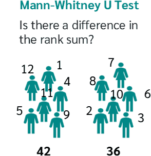

```{r}
#| label: load_libraries_data_R
#| echo: false
# Load libraries and data
library(Seurat)
library(tidyverse)
library(ggplot2)
library(cowplot)

# Load data
seurat_integrated <- readRDS("data/additional_data/seurat_integrated.rds")
Idents(seurat_integrated) <- "integrated_snn_res.0.8"

# Set randomness
set.seed(1234)
```

```{python}
#| label: load_libraries_data_py
#| echo: false
# Load libraries and data
import scanpy as sc
import pandas as pd
import numpy as np
import seaborn as sns
import matplotlib.pyplot as plt

# Set tight_layout universally
plt.rcParams["figure.autolayout"] = True
plt.rcParams["figure.constrained_layout.use"] = True

# Load data
adata_integrated = sc.read_h5ad("data/additional_data/adata_integrated.h5ad")

# Set randomness
np.random.seed(1234)
```

Approximate time: 75 minutes

## Learning objectives 

In this lesson, we will:

- Describe how to determine markers of individual clusters
- Discuss the iterative processes of clustering and marker identification

## Overview of lesson

Now that we have identified our desired clusters, we can move on to marker identification. This will allow us to verify the identity of certain clusters and help surmise the identity of any unknown clusters.

::: {#fig-sc-workflow .figure}
{width=630}

Overview of the single-cell RNA-seq workflow.
:::


## Current clustering

**Remember that we had the following questions from the clustering analysis**: 

1. _Do the clusters corresponding to the same cell types have biologically meaningful differences? Are there subpopulations of these cell types?_
2. _Can we acquire higher confidence in these cell type identities by identifying other marker genes for these clusters?_


**Identification of all markers for each cluster:** this analysis compares each cluster against all others and outputs the genes that are differentially expressed/present. 
	- *Useful for identifying unknown clusters and improving confidence in hypothesized cell types.*

Our clustering analysis resulted in the following clusters:

::: {.panel-tabset group="language"}
## R

```{r}
#| label: fig-integrated_DimPlot_0.8
#| fig-cap: UMAP plot, representing each cell as a colored point corresponding with the cluster identified at resolution 0.8.
# Plot the UMAP colored by resolution 0.8
DimPlot(seurat_integrated,
        group.by = "integrated_snn_res.0.8",
        reduction = "umap",
        label = TRUE,
        label.size = 6)
```

## Python

```{python}
#| label: fig-integrated_DimPlot_0.8_py
#| fig-cap: UMAP plot, representing each cell as a colored point corresponding with the cluster identified at resolution 0.8.
# Plot the UMAP
sc.pl.embedding(adata_integrated, 
                color = "leiden_0.8", 
                basis = "umap_scvi",
                legend_loc = "on data",
                legend_fontsize = 14,
                legend_fontoutline = 3)
```

:::

## Wilcoxon rank-sum test

In order to identify which genes are uniquely expressed in one population over another, we make use of the Wilcoxon rank-sum test (also known as the Mann-Whitney U test). This is a [non-parametric statistical method](https://en.wikipedia.org/wiki/Mann%E2%80%93Whitney_U_test) used to determine whether two groups of cells (i.e., cluster A vs. all other cells, or condition 1 vs. condition 2) have significantly different expression levels for a gene. This method does not assume a normal distribution, which is important for the sparse and zero-inflated nature of single-cell sequencing.

::: {#fig-wilcox .figure}
{width=300}

Schematic of how the Wilcoxon test uses ranking to identify differences between populations.<br>
_Image source: [Numiqo](https://numiqo.com/tutorial/mann-whitney-u-test)_
:::

The general steps of how this test is utilized in a single-cell workflow are as follows:

1. For a single gene, rank the normalized expression values for each cell in the two conditions of interest.
2. Sum the ranks for each group separately.
3. If one group consistently has higher ranks than the other, this suggests that the gene is differentially expressed between the groups.
4. This test statistic is then converted into a p-value.
5. Given that we are testing many genes simultaneously, we apply a multiple test correction (Bonferroni correction or Benjamini-Hochberg) to calculate an adjusted p-value.
6. The average expression of the gene is computed for each group of cells to calculate the log fold change between the two populations.

## Rank all clusters simultaneously

This type of analysis is typically **recommended for when evaluating a single sample group/condition**. We can compare each cluster against all other clusters to identify potential marker genes. The cells in each cluster are treated as replicates, and essentially a **differential expression analysis is performed** with a chosen statistical test. 

::: {#fig-marker-ident-function1 .figure}
{width=350}

Schematic of identifying markers for each cluster by comparing one cluster against all other cells.
:::

### Identifying genes

::: {.panel-tabset group="language"}
## R

Before we start marker identification, we will explicitly set our **default assay**. We want to use the normalized data, but not the integrated data.

```{r}
#| label: set_default_assay
DefaultAssay(seurat_integrated) <- "RNA"
Idents(seurat_integrated) <- "integrated_snn_res.0.8"
```

The default assay should have already been `RNA`, because we set it up in the previous clustering quality control lesson. But we encourage you to run this line of code above to be absolutely sure in case the active slot was changed somewhere upstream in your analysis. 

::: callout-note
# Why don't we use SCT normalized data?
Note that the raw and normalized counts are stored in the `counts` and `data` slots of `RNA` assay, respectively. By default, the functions for finding markers will use normalized data if RNA is the DefaultAssay. The number of features in the `RNA` assay corresponds to all genes in our dataset.

Now if we consider the `SCT` assay, functions for finding markers would use the `scale.data` slot which is the pearson residuals that come out of regularized NB regression. Differential expression on these values can be difficult to interpret. Additionally, only the variable features are represented in this assay and so we may not have data for some of our marker genes.
:::

The `FindAllMarkers()` function has **three important arguments** which provide thresholds for determining whether a gene is a marker:


| Argument | Description | Cons |
|---|---|---|
| `logfc.threshold` | Minimum log2 fold change a gene must show between the cluster and all other clusters. Default: 0.25. | - May miss markers only expressed in a small subset of cells within the cluster<br>- May include metabolic/ribosomal genes with small but consistent expression differences that aren't useful for identifying cell type |
| `min.diff.pct` | Minimum difference in the percentage of cells expressing the gene between the cluster and all other clusters. | May miss markers that are expressed in most cells but strongly upregulated in one cell type |
| `min.pct` | Only tests genes detected in at least this fraction of cells in either group being compared. Speeds up the function by skipping rarely-detected genes. Default: 0.1. | Setting this too high may cause false negatives, since genes aren't always detected in every cell that expresses them |

```{r}
#| label: FindAllMarkers_example
#| eval: false
# Find markers for every cluster compared to all remaining cells, report only the positive ones
markers <- FindAllMarkers(seurat_integrated, 
                          assay = "RNA",
                          layer = "data",
                          only.pos = TRUE,
                          logfc.threshold = 0.25)
```

```{r}
#| label: load_FindAllMarkers
#| eval: true
# write.csv(markers, "intermediate/13_findallmarkers.csv")                     
markers <- read.csv("intermediate/13_findallmarkers.csv",
                    row.names = 1)
```


## Python

The `tl.rank_genes_groups()` function has **several important arguments** which provide thresholds for determining whether a gene is a marker:


| Parameter | Description |
|---|---|
| `layer = "log"` | Specifies which layer of the data to use (in this case, log-normalized expression values). |
| `groupby = "leiden_0.8"` | The cell metadata column used to define groups for comparison, in this case cluster labels from Leiden clustering at resolution 0.8. |
| `reference = "rest"` | Sets the comparison group. `"rest"` means each cluster is compared against all other clusters combined, rather than against one specific cluster. |
| `method = "wilcoxon"` | Specifies the statistical test used to identify differentially expressed genes; here, the Wilcoxon rank-sum (Mann-Whitney U) test. |
| `corr_method = "benjamini-hochberg"` | The method used to correct p-values for multiple testing across genes; here, the Benjamini-Hochberg procedure, which controls the false discovery rate. |
| `key_added = "all_clusters"` | The name under which the results will be stored in `adata_integrated.uns`, allowing this specific analysis run to be retrieved later. |

```{python}
#| label: run_wilcox
#| eval: true
# Run Wilcoxon test
# Find markers for every cluster compared to all remaining cells
sc.tl.rank_genes_groups(adata_integrated, 
                        layer = "log",
                        groupby = "leiden_0.8", 
                        reference = "rest",
                        method = "wilcoxon",
                        corr_method = "benjamini-hochberg",
                        key_added = "all_clusters")
```

<!-- However not every single one of the genes in these results will be as informative. Therefore we will apply a filtering step with `tl.filter_rank_genes_groups()` function. 

TODO: list requirements for filtration -->

```{python}
#| label: filter_all_clusters
#| eval: true
#| echo: false
# Filter results to only retain positive markers with logfc.threshold equivalent to 0.25 LFC
sc.tl.filter_rank_genes_groups(adata_integrated,
                               key = "all_clusters",
                               key_added = "all_clusters_filtered",
                               # disable pct-based filtering
                               min_in_group_fraction = 0.01,
                               max_out_group_fraction = 1,
                               # convert log2FC threshold (0.25) to fold-change scale
                               min_fold_change = 2**0.25) 
```

:::

### Find markers results

The output is a dataframe containing a ranked list of putative markers listed by gene ID for each cluster, and associated statistics.

::: {.panel-tabset group="language"}
## R

```{r}
#| label: view_findAllMarkers
#| eval: false
View(markers)
```

```{r}
#| label: tbl-view_findAllMarkers
#| tbl-cap: Top genes for each cluster after running a Wilcoxon test.
#| echo: false
markers %>% 
  head() %>% 
  knitr::kable()
```

| Column | Description |
|---|---|
| **gene** | Gene symbol |
| **p_val** | P-value (not adjusted for multiple test correction) |
| **avg_log2FC** | Average log2 fold change between the cluster and all other clusters combined. Positive values indicate the gene is more highly expressed in the cluster. |
| **pct.1** | Percentage of cells where the gene is detected in the cluster of interest |
| **pct.2** | Percentage of cells where the gene is detected in all other clusters combined |
| **p_val_adj** | Adjusted p-value, based on Bonferroni correction using all genes in the dataset, used to determine significance |
| **cluster** | The cluster identity being tested against all remaining cells |

When looking at the output, **we suggest looking for markers with large differences in expression between `pct.1` and `pct.2` and larger fold changes**. For instance if `pct.1` = 0.90 and `pct.2` = 0.80, it may not be as exciting of a marker. However, if `pct.2` = 0.1 instead, the bigger difference would be more convincing. Also, of interest is if the majority of cells expressing the marker is in my cluster of interest. If `pct.1` is low, such as 0.3, it may not be as interesting. Both of these are also possible parameters to include when running the function, as described above.

## Python

```{python}
#| label: view_markers_df
#| eval: false
# Get the dataframe of top genes per cluster
markers = sc.get.rank_genes_groups_df(adata_integrated, 
                                      group = None, 
                                      key = "all_clusters")

markers.head()
```

```{python}
#| label: tbl-view_findAllMarkers_py
#| tbl-cap: Top genes for each cluster after running a Wilcoxon test.
#| echo: false
#| results: asis
# Get the dataframe of top genes per cluster
markers = sc.get.rank_genes_groups_df(adata_integrated, 
                                         group = None, 
                                         key = "all_clusters")

print(markers.head().to_markdown())
```

| Column | Description |
|---|---|
| **names** | Gene symbol |
| **scores** | Test statistic (z-score) from the Wilcoxon rank-sum test; higher absolute values indicate stronger evidence of differential expression |
| **logfoldchanges** | Log2 fold change between the cluster and the reference group. Positive values indicate the gene is more highly expressed in the cluster. |
| **pvals** | P-value (not adjusted for multiple test correction) |
| **pvals_adj** | Adjusted p-value, based on the correction method specified in `corr_method` (e.g., Benjamini-Hochberg), used to determine significance |
| **group** | The cluster identity being tested against the reference group |


:::


::: callout-note
# Inflated p-values
Since _each cell is being treated as a replicate_ this will result in inflated p-values within each group! A gene may have an incredibly low p-value < 1e-50 but that doesn't translate as a highly reliable marker gene. 
:::

**You may notice that ribosomal genes are popping up as a lot of the top genes, with genes that start with `RPS` or `RPL`.** Shifts in metabolic state are quite common and can be useful pieces of information. However, at this step we are attempting to identify the cell types of each cluster. Therefore, these genes are not as informative, so we are going to remove these genes from our dataframes to more clearly see our cell type markers.

::: {.panel-tabset group="language"}
## R

```{r}
#| label: rm_ribo
#| eval: false
# Remove genes that start with "RPL" or "RPS"
markers_filtered <- markers %>%
  filter(!grepl("^(RPL|RPS)", gene))

View(markers_filtered)
```

```{r}
#| label: tbl-view_findAllMarkers_rm_ribo
#| tbl-cap: Top genes for each cluster after running a Wilcoxon test and removing ribosomal genes.
#| echo: false
# Remove genes that start with "RPL" or "RPS"
markers_filtered <- markers %>%
  filter(!grepl("^(RPL|RPS)", gene))

markers_filtered %>% 
  head() %>% 
  knitr::kable()
```

## Python

```{python}
#| label: rm_ribo_py
#| eval: false
# Remove genes that start with "RPL" or "RPS"
markers_filtered = markers[~markers["names"].str.startswith(("RPS", "RPL"))]

markers_filtered.head()
```

```{python}
#| label: tbl-view_findAllMarkers_rm_ribo_py
#| tbl-cap: Top genes for each cluster after running a Wilcoxon test and removing ribosomal genes.
#| echo: false
#| results: asis
# Remove genes that start with "RPL" or "RPS"
markers_filtered = markers[~markers["names"].str.startswith(("RPS", "RPL"))]

print(markers_filtered.head().to_markdown())
```

:::

### Adding gene annotations

At this point, we are able to identify which genes of ours are significant by setting an adjusted p-value threshold. However, it can be challenging to keep track of what each gene does and what its gene name stands for. It can be helpful to add columns with gene annotation information. In order to do that we will load in an annotation file located in your `data/additional_data/` folder.

::: callout-note
# How to create annotation file
If you are interested in knowing how we obtained this annotation file, take a look at [the linked materials](Aside_fetching_annotations.qmd).
:::

We can load it into our environment like so:

::: {.panel-tabset group="language"}
## R

```{r}
#| label: read_in_annotations
#| eval: false
# Load pre-generated annotations file
annotations <- read.csv("data/additional_data/annotation.csv")

View(annotations)
```

```{r}
#| label: tbl-annotations
#| tbl-cap: Preview of annotations file that contains information about the genes in our dataset.
#| echo: false
# Load pre-generated annotations file
annotations <- read.csv("data/additional_data/annotation.csv")

annotations %>% 
  head() %>% 
  knitr::kable()
```

## Python

```{python}
#| label: annotations
#| eval: false
# Load pre-generated annotations file
annotations = pd.read_csv("data/additional_data/annotation.csv")

annotations.head()
```

```{python}
#| label: tbl-annotations_py
#| tbl-cap: Preview of annotations file that contains information about the genes in our dataset.
#| echo: false
#| results: asis
# Load pre-generated annotations file
annotations = pd.read_csv("data/additional_data/annotation.csv")

print(annotations.head().to_markdown())
```

:::

Notice that the column `gene_name` should be able to map well onto our `markers_filtered` dataframe. So in this next step we will merge together the two tables.

::: {.panel-tabset group="language"}
## R

```{r}
#| label: anno_markers
#| eval: false
# Add description column to Wilcoxon results
markers_filtered_anno <- markers_filtered %>% 
  left_join(y = unique(annotations[, c("gene_name", "description")]),
            by = c("gene" = "gene_name"))

View(markers_filtered_anno)
```

```{r}
#| label: tbl-anno_markers
#| tbl-cap: Results from `FindAllMarkers()` with description column added from our annotations file.
#| echo: false
# Add description column to Wilcoxon results
markers_filtered_anno <- markers_filtered %>% 
  left_join(y = unique(annotations[, c("gene_name", "description")]),
            by = c("gene" = "gene_name"))

markers_filtered_anno %>% 
  head() %>% 
  knitr::kable()
```

## Python

```{python}
#| label: anno_markers_py
#| eval: false
# Add description column to Wilcoxon results
markers_filtered_anno = markers_filtered.merge(
    annotations[["gene_name", "description"]].drop_duplicates(),
    how="left",
    left_on="names",
    right_on="gene_name"
)

markers_filtered_anno.head()
```

```{python}
#| label: tbl-anno_markers_py
#| tbl-cap: Results from `tl.rank_gene_groups()` with description column added from our annotations file.
#| echo: false
#| results: asis
# Add description column to Wilcoxon results
markers_filtered_anno = markers_filtered.merge(
    annotations[["gene_name", "description"]].drop_duplicates(),
    how="left",
    left_on="names",
    right_on="gene_name"
)

print(markers_filtered_anno.head().to_markdown())
```

:::

## Conserved markers

Since we have samples representing different conditions in our dataset, **our best option is to find conserved markers**. This function internally separates out cells by sample group/condition, and then performs differential gene expression testing for a single specified cluster against all other clusters (or a second cluster, if specified). Gene-level p-values are computed for each condition and then combined across groups using meta-analysis methods from the `MetaDE` _R_ package.

::: {#fig-marker-ident-function2 .figure}
{width=350}

Schematic of identifying conserved markers across conditions for a given cluster.
:::

::: {.panel-tabset group="language"}
## R

### `FindConservedMarkers()` syntax

```{r}
#| label: FindConservedMarkers_example
#| eval: false
## DO NOT RUN ##
FindConservedMarkers(seurat_integrated,
                      ident.1 = cluster,
                      grouping.var = "sample",
                      only.pos = TRUE,
                      min.diff.pct = 0.25,
                      min.pct = 0.25,
                      logfc.threshold = 0.25)
```

You will recognize some of the arguments we described previously for the `FindAllMarkers()` function; this is because internally it is using that function to first find markers within each group. Here, we list **some additional arguments** which provide for when using `FindConservedMarkers()`:

- `ident.1`: this function only evaluates one cluster at a time; here you would specify the cluster of interest.
- `grouping.var`: the variable (column header) in your metadata which specifies the separation of cells into groups

For our analysis we will be fairly lenient and **use only the log fold change threshold greater than 0.25**. We will also specify to return only the positive markers for each cluster.

### Running `FindConservedMarkers()`

Let's **test it out on one cluster** to see how it works:

```{r}
#| label: FindConservedMarkers_cluster_1
#| eval: false
cluster1_conserved_markers <- FindConservedMarkers(seurat_integrated,
                                                    ident.1 = 1,
                                                    grouping.var = "sample",
                                                    only.pos = TRUE,
                                                    logfc.threshold = 0.25)

# Inspect the output of FindConservedMarkers
View(cluster1_conserved_markers)
```

```{r}
#| label: tbl-FindConservedMarkers_cluster_1
#| tbl-cap: "Output from FindConservedMarkers"
#| echo: false
cluster1_conserved_markers <- FindConservedMarkers(seurat_integrated,
                                                    ident.1 = 1,
                                                    grouping.var = "sample",
                                                    only.pos = TRUE,
                                                    logfc.threshold = 0.25)

cluster1_conserved_markers %>% 
  head(n = 10) %>% 
  knitr::kable()
```

**The output from the `FindConservedMarkers()` function** is a matrix containing a ranked list of putative markers listed by gene ID for the cluster we specified, and associated statistics. Note that the same set of statistics are computed for each group (in our case, Ctrl and Stim) and the last two columns correspond to the combined p-value across the two groups. We describe some of these columns below:

- **gene:** gene symbol
- **condition_p_val:** p-value not adjusted for multiple test correction for condition
- **condition_avg_logFC:** average log fold change for condition. Positive values indicate that the gene is more highly expressed in the cluster.	
- **condition_pct.1:** percentage of cells where the gene is detected in the cluster for condition		
- **condition_pct.2:** percentage of cells where the gene is detected on average in the other clusters for condition
- **condition_p_val_adj:** adjusted p-value for condition, based on bonferroni correction using all genes in the dataset, used to determine significance
- **max_pval:**	largest p value of p value calculated by each group/condition
- **minimump_p_val:** combined p value

When looking at the output, **we suggest looking for markers with large differences in expression between `pct.1` and `pct.2` and larger fold changes**. For instance if `pct.1` = 0.90 and `pct.2` = 0.80, it may not be as exciting of a marker. However, if `pct.2` = 0.1 instead, the bigger difference would be more convincing. Also, of interest is if the majority of cells expressing the marker is in my cluster of interest. If `pct.1` is low, such as 0.3, it may not be as interesting. Both of these are also possible parameters to include when running the function, as described above.

### Running on multiple samples

The function `FindConservedMarkers()` **accepts a single cluster at a time**, and we could run this function as many times as we have clusters. However, this is not very efficient. Instead we will first create a function to find the conserved markers including all the parameters we want to include. We will also **add a few lines of code to modify the output**. Our function will:

1. Run the `FindConservedMarkers()` function
2. Transfer row names to a column using the `rownames_to_column()` function
3. Merge in annotations
4. Create the column of cluster IDs using the `cbind()` function

```{r}
#| label: create_get_cluster_function
# Create function to get conserved markers for any given cluster
get_conserved <- function(cluster){
  FindConservedMarkers(seurat_integrated,
                       ident.1 = cluster,
                       grouping.var = "sample",
                       only.pos = TRUE) %>%
    rownames_to_column(var = "gene") %>%
    left_join(y = unique(annotations[, c("gene_name", "description")]),
               by = c("gene" = "gene_name")) %>%
    cbind(cluster_id = cluster, .)
  }
```

Now that we have this function created  we can use it as an argument to the appropriate `map` function. We want the output of the `map` family of functions to be a **dataframe with each cluster output bound together by rows**, we will use the `map_dfr()` function.

**`map` family syntax:**

```{r}
#| label: map_dfr_example
#| eval: false
## DO NOT RUN ##
map_dfr(inputs_to_function, name_of_function)
```

Now, let's try this function to **find the conserved markers for the clusters that were identified as CD4+ T cells (1, 3, 6, 8)** from our use of known marker genes. Let's see what genes we identify and if there are overlaps or obvious differences that can help us tease this apart a bit more.

```{r}
#| label: iterate_conserved_markers_across_select_clusters
#| eval: false
# Iterate function across desired clusters
conserved_markers <- map_dfr(c(1, 3, 6, 8), get_conserved) %>%
  filter(!grepl("^(RPL|RPS)", gene))

head(conserved_markers)
```

```{r}
#| label: tbl-iterate_conserved_markers_across_select_clusters
#| tbl-cap: Output from `FindConservedMarkers` for multiple clusters after wrangling with the custom function `get_conserved`.
#| echo: false
# Iterate function across desired clusters
conserved_markers <- map_dfr(c(1, 3, 6, 8), get_conserved) %>%
  filter(!grepl("^(RPL|RPS)", gene))
  
conserved_markers %>%
  head() %>%
  knitr::kable()
```

::: callout-note
# Finding markers for all clusters
For your data, you may want to run this function on all clusters, in which case you could input `0:20` instead of `c(1, 3, 6, 8)`; however, it would take quite a while to run. Also, it is possible that when you run this function on all clusters, in **some cases you will have clusters that do not have enough cells for a particular group** - and  your function will fail. For these clusters you will need to use `FindAllMarkers()`.
:::


## Python

This method of identifying differential genes is not available in the scanpy workflow. In the Seurat, R-based workflow this function is known as `FindConservedMarkers()`

:::


## Evaluating marker genes

We would like to use these gene lists to see if we can **identify which cell types these clusters identify with.** Let's take a look at the top genes for each of the clusters and see if that gives us any hints. We can view the top 10 markers for each CD4+ T cell cluster for a quick perusal:

::: {.panel-tabset group="language"}
## R


```{r}
#| label: extract_top_markers
#| eval: false
# Extract top 10 markers per cluster
top10 <- conserved_markers %>% 
  group_by(cluster_id) %>% 
  slice_head(n = 10)

# Visualize top 10 markers per cluster
View(top10)
```


```{r}
#| label: tbl_top_markers
#| tbl-cap: "Inspecting the top 10 genes for each CD4+ T cell cluster."
#| echo: false
# Extract top 10 markers per cluster
top10 <- conserved_markers %>% 
  group_by(cluster_id) %>% 
  slice_head(n = 10)

# Visualize top 10 markers per cluster
top10 %>%
  head() %>%
  knitr::kable()
```

When we look at the entire list, we see clusters 1 and 3 have some overlapping genes, like CCR7 and SELL which correspond to **markers of memory T cells**. It is possible that these two clusters are more similar to one another and could be merged together as naive T cells. On the other hand, with cluster 3 we observe CREM as one of our top genes; a **marker gene of activation**. This suggests that perhaps cluster 3 represents activated T cells.

## Python

```{python}
#| label: extract_top_markers_py
#| eval: false
# Grab top 10 genes from CD4+ T cell clusters
top10_markers = (
    markers_filtered_anno[markers_filtered_anno["group"].isin(["0", "1", "4", "6"])]
    .groupby("group", as_index = False)
    .head(10)
    .reset_index(drop=True)
)

top10_markers
```

```{python}
#| label: tbl-top_markers_py
#| tbl-cap: "Inspecting the top 10 genes for each CD4+ T cell cluster."
#| echo: false
#| results: asis
# Grab top 10 genes from CD4+ T cell clusters
top10_markers = (
    markers_filtered_anno[markers_filtered_anno["group"].isin(["0", "1", "4", "6"])]
    .groupby("group", as_index=False)
    .head(10)
    .reset_index(drop=True)
)

print(top10_markers.head().to_markdown())
```

When we look at the entire list, we see clusters 0 and 1 have some overlapping genes, like CCR7 and SELL which correspond to **markers of memory T cells**. It is possible that these two clusters are more similar to one another and could be merged together as naive T cells. On the other hand, with cluster 1 we observe CREM as one of our top genes; a **marker gene of activation**. This suggests that perhaps cluster 1 represents activated T cells.

:::

There is also another cluster with high expression values for heat shock and DNA damage genes appear in the top gene list. Based on these markers, it is likely that these are **stressed or dying cells**. However, if we explore the quality metrics for these cells in more detail (i.e. mitoRatio and nUMI overlayed on the cluster) we do not find much support for this interpretation. There is a breadth of research supporting the association of heat shock proteins with reactive T cells in the induction of anti‐inflammatory cytokines in chronic inflammation. This is a cluster for which we would need a _deeper understanding of immune cells_ to really tease apart the results and make a final conclusion.

| Cell State | Marker |
|:---:|:---:|
| Naive T cells | CCR7, SELL | 
| Activated T cells | CREM, CD69 |
| Heat shock proteins | HSPH1, HSPE1 |
| DNA damage repair | DNAJB1 |

Let us make a dotplot of each of these genes to more clearly see which populations are highlighting these genes:

::: {.panel-tabset group="language"}
## R

```{r}
#| label: fig-DotPlot_known_markers
#| fig-cap: DotPlot representing top marker genes for a variety of cell types, with each circle representing the average expression of that cluster and the size showing the percentage of cells that express that gene.
#| fig.width: 10
# List of identified interesting genes
markers <- list(
  "CD4+ T cells" = c("CD3D", "IL7R"),
  "Naive T cells" = c("CCR7", "SELL"),
  "Activated T cells" = c("CREM", "CD69"),
  "Heat shock proteins" = c("HSPH1", "HSPE1"),
  "DNA damage repair" = c("DNAJB1"))

# Create dotplot based on RNA expression
DotPlot(seurat_integrated, 
        markers, 
        assay = "RNA", 
        idents = c("1", "3", "6", "8")) +
  theme(axis.text.x = element_text(angle = 90, vjust = 0.5, hjust=1))
```

For cluster 6, we see a lot of heat shock and DNA damage genes appear in the top gene list. Based on these markers, it is likely that these are **stressed or dying cells**. However, if we explore the quality metrics for these cells in more detail (i.e. mitoRatio and nUMI overlayed on the cluster) we don't really support for this argument. There is a breadth of research supporting the association of heat shock proteins with reactive T cells in the induction of anti‐inflammatory cytokines in chronic inflammation. This is a cluster for which we would need a deeper understanding of immune cells to really tease apart the results and make a final conclusion.

## Python

```{python}
#| label: DotPlot_known_markers_py
#| fig-cap: DotPlot representing top marker genes for a variety of cell types, with each circle representing the average expression of that cluster and the size showing the percentage of cells that express that gene.
#| fig-width: 20
# Subset the AnnData object to only include clusters 0, 1, 4, and 6
adata_subset = adata_integrated[adata_integrated.obs["leiden_0.8"].isin(["0", "1", "4", "6"])]

# List of identified interesting genes
markers = {
    "CD4+ T cells": ["CD3D", "IL7R", "CCR7"],
    "Naive T cells": ["CCR7", "SELL"],
    "Activated T cells": ["CREM", "CD69"],
    "Heat shock proteins": ["HSPH1", "HSPE1"],
    "DNA damage repair": ["DNAJB1"]}

# Create dotplot based on RNA expression
sc.pl.dotplot(adata_subset, 
              markers, 
              groupby = "leiden_0.8",
              swap_axes = True,
              figsize=(10, 6))
```

For cluster 4, we see a lot of heat shock and DNA damage genes appear in the top gene list. Based on these markers, it is likely that these are **stressed or dying cells**. However, if we explore the quality metrics for these cells in more detail (i.e. mitoRatio and nUMI overlayed on the cluster) we don't really support for this argument. There is a breadth of research supporting the association of heat shock proteins with reactive T cells in the induction of anti‐inflammatory cytokines in chronic inflammation. This is a cluster for which we would need a deeper understanding of immune cells to really tease apart the results and make a final conclusion.

:::


## Differentiating subtypes

Sometimes the list of markers returned does not sufficiently some clusters. For instance, we had previously identified multiple clusters as CD4+ T cells, but when looking at marker gene lists we identified markers to help us further subset cells. We were lucky and the signal observed from each cluster helped us differentiate between naive and activated cells. Another option for identifying biologically meaningful differences would be to identify genes that are _differentially expressed between **two specific clusters**._

::: {#fig-marker-ident-function3 .figure}
{width=350}

Schematic of identifying markers differentiating one cluster from specific comparison clusters.
:::


::: {.panel-tabset group="language"}
## R

We can try all combinations of comparisons, but we'll start with cluster 3 versus all other CD4+ T cell clusters:

```{r}
#| label: FindMarkers_T_cell
# Determine differentiating markers for CD4+ T cell
cd4_tcells <- FindMarkers(seurat_integrated,
                          ident.1 = 3,
                          ident.2 = c(1, 6, 8))                  

# Add gene descriptions to the DE table
cd4_tcells <- cd4_tcells %>%
  rownames_to_column(var = "gene") %>%
  left_join(y = unique(annotations[, c("gene_name", "description")]),
            by = c("gene" = "gene_name"))

# Reorder columns and sort by padj
cd4_tcells <- cd4_tcells[, c(1, 3:5,2,6:7)]
cd4_tcells <- cd4_tcells %>%
  dplyr::arrange(p_val_adj) 
```

```{r}
#| label: show_t_cell_markers
#| eval: false
# View data
View(cd4_tcells)
```

```{r}
#| label: tbl-t_cell_markers_table_head
#| tbl-cap: Top markers of cluster 3 vs CD4+ T cells.
#| echo: false
cd4_tcells %>% 
  head() %>%
  knitr::kable()
```

```{r}
#| label: tbl-t_cell_markers_table_tail
#| tbl-cap: Negative markers of cluster 3 vs CD4+ T cells.
#| echo: false
cd4_tcells %>% 
  subset(gene %in% c("SELL", "CCR7")) %>%
  knitr::kable()
```

Of these top genes the **CREM gene** stands out as a marker of activation with a positive fold change.  We also see markers of naive or memory cells include the SELL and CCR7 genes with negative fold changes, which is in line with previous results. 

As markers for the naive and activated states both showed up in the marker list, it is helpful to visualize expression. Based on these plots it seems as though clusters 1 are reliably the naive T cells. However, for the activated T cells it is hard to tell. We might say that clusters 3 are activated T cells, but the CD69 expression is not as apparent as CREM. We will label the naive cells and leave the remaining clusters labeled as CD4+ T cells.


## Python

We can try all combinations of comparisons, but we'll start with cluster 1 versus all other CD4+ T cell clusters:

```{python}
#| label: FindMarkers_T_cell_py
#| eval: false
# Determine differentiating markers for CD4+ T cell
# Comparing cluster 1 vs. the rest of the subset (0, 4, 6)
sc.tl.rank_genes_groups(adata_subset, 
                        layer = "log",
                        groupby = "leiden_0.8", 
                        groups = ["1"],
                        reference = "rest",
                        method = "wilcoxon",
                        corr_method = "benjamini-hochberg",
                        key_added = "cd4t")

# Get dataframe of genes
cd4_tcells = sc.get.rank_genes_groups_df(adata_subset, 
                                         group = "1",
                                         key = "cd4t")
# Remove ribosomal genes that start with "RPL" or "RPS"
cd4_tcells = cd4_tcells[~cd4_tcells["names"].str.startswith(("RPS", "RPL"))]

cd4_tcells
```

```{python}
#| label: tbl-t_cell_markers_table_head_py
#| tbl-cap: Top markers of cluster 1 vs CD4+ T cells.
#| echo: false
#| results: asis
# Determine differentiating markers for CD4+ T cell
# Comparing cluster 1 vs. the rest of the subset (0, 4, 6)
sc.tl.rank_genes_groups(adata_subset,
                        layer = "log",
                        groupby = "leiden_0.8", 
                        groups = ["1"],
                        reference = "rest",
                        method = "wilcoxon",
                        corr_method = "benjamini-hochberg",
                        key_added = "cd4t")

cd4_tcells = sc.get.rank_genes_groups_df(adata_subset, 
                                         group = "1",
                                         key = "cd4t")
# Remove genes that start with "RPL" or "RPS"
cd4_tcells = cd4_tcells[~cd4_tcells["names"].str.startswith(("RPS", "RPL"))]

print(cd4_tcells.head().to_markdown())
```

```{python}
#| label: tbl-t_cell_markers_table_tail_py
#| tbl-cap: Negative markers of cluster 1 vs CD4+ T cells.
#| echo: false
#| results: asis
subset = cd4_tcells[cd4_tcells["names"].isin(["SELL", "CCR7"])]
print(subset.to_markdown())
```

Of these top genes the **CREM gene** stands out as a marker of activation with a positive fold change.  We also see markers of naive or memory cells include the SELL and CCR7 genes with negative fold changes, which is in line with previous results. 

As markers for the naive and activated states both showed up in the marker list, it is helpful to visualize expression. Based on these plots it seems as though cluster 0 are reliably the naive T cells. However, for the activated T cells it is hard to tell. We might say that clusters 1 and 6 are activated T cells, but the CREM expression is not as apparent as CD69 in 6. We will label the naive cells and leave the remaining clusters labeled as CD4+ T cells.

:::


Now taking all of this information, we can surmise the cell types of the different clusters and plot the cells with cell type labels. Based on the marker-gene analysis, we will assign the following provisional cell-type labels:


::: {.panel-tabset group="language"}
## R

| Cluster ID | Cell Type |
|:-----:|:-----:|
| 1  | Naive CD4+ T cells |
| 2  | CD14+ monocytes |
| 3  | Activated T cells |
| 4  | CD14+ monocytes |
| 5  | CD8+ T cells |
| 6  | Stressed cells / Unknown |
| 7  | B cells |
| 8  | CD4+ T cells |
| 9  | NK cells |
| 10 | FCGR3A+ monocytes |
| 11 | B cells |
| 12 | NK cells |
| 13 | Conventional dendritic cells |
| 14 | B cells |
| 15 | Megakaryocytes |
| 16 | Plasmacytoid dendritic cells |

We can then reassign the identity of the clusters to these cell types:

```{r}
#| label: fig-rename_clusters
#| fig-cap: UMAP visualization with each cell colored by celltype annotation.
# Make sure idents are set correctly
Idents(seurat_integrated) <- "integrated_snn_res.0.8"

# Rename all identities
seurat_integrated <- RenameIdents(seurat_integrated,
  "1"  = "Naive CD4+ T cells",
  "2"  = "CD14+ monocytes",
  "3"  = "Activated T cells",
  "4"  = "CD14+ monocytes",
  "5"  = "CD8+ T cells",
  "6"  = "Stressed cells / Unknown",
  "7"  = "B cells",
  "8"  = "CD4+ T cells",
  "9"  = "NK cells",
  "10" = "FCGR3A+ monocytes",
  "11" = "B cells",
  "12" = "NK cells",
  "13" = "Conventional dendritic cells",
  "14" = "B cells",
  "15" = "Megakaryocytes",
  "16" = "Plasmacytoid dendritic cells"
)

# Plot the UMAP
DimPlot(object = seurat_integrated, 
        reduction = "umap", 
        label = TRUE,
        label.size = 3,
        repel = TRUE)
```

## Python

| Cluster ID | Cell Type |
|:-----:|:-----:|
| 0  | Naive CD4+ T cells |
| 1  | Activated T cells |
| 2  | CD14+ monocytes |
| 3  | Conventional dendritic cells |
| 4  | Stressed cells / Unknown |
| 5  | Plasmacytoid dendritic cells |
| 6  | CD4+ T cells |
| 7  | Stressed cells / Unknown |
| 8  | CD8+ T cells |
| 9  | NK cells |
| 10 | B cells |
| 11 | B cells |
| 12 | CD14+ monocytes |
| 13 | FCGR3A+ monocytes |
| 14 | T cells |
| 15 | Megakaryocytes |
| 16 | T cells |

We can then reassign the identity of the clusters to these cell types:


```{python}
#| label: fig-rename_clusters_py
#| fig-cap: UMAP visualization with each cell colored by celltype annotation.
# Define mapping from leiden_0.8 cluster IDs to cell type labels
cluster_to_celltype = {
    "0": "Naive CD4+ T cells",
    "1": "Activated T cells",
    "2": "CD14+ monocytes",
    "3": "Conventional dendritic cells",
    "4": "Stressed cells / Unknown",
    "5": "Plasmacytoid dendritic cells",
    "6": "CD4+ T cells",
    "7": "Stressed cells / Unknown",
    "8": "CD8+ T cells",
    "9": "NK cells",
    "10": "B cells",
    "11": "B cells",
    "12": "CD14+ monocytes",
    "13": "FCGR3A+ monocytes",
    "14": "T cells",
    "15": "Megakaryocytes",
    "16": "T cells"
}

# Create new 'celltype' column based on the mapping
adata_integrated.obs["celltype"] = adata_integrated.obs["leiden_0.8"].map(cluster_to_celltype)


# Plot the UMAP
sc.pl.embedding(adata_integrated, 
                color = "celltype",
                basis = "umap_scvi",
                legend_loc = "on data",
                legend_fontsize = 7,
                legend_fontoutline = 2)
```

:::

If we wanted to remove the potentially stressed cells, we can remove all cells labelled as `Stressed cells / Unknown`.

::: {.panel-tabset group="language"}
## R

```{r}
#| label: removed_dying_cells_DimPlot
#| fig-cap: UMAP visualization with each cell colored by celltype annotation after removing stressed/dying cells.
# Remove the stressed or dying cells
seurat_subset_labeled <- subset(seurat_integrated,
                                idents = "Stressed cells / Unknown", 
                                invert = TRUE)

# Re-visualize the clusters
DimPlot(object = seurat_subset_labeled, 
        reduction = "umap", 
        label = TRUE,
        label.size = 3,
	      repel = TRUE)
```

## Python

```{python}
#| label: removed_dying_cells_DimPlot_py
#| fig-cap: UMAP visualization with each cell colored by celltype annotation after removing stressed/dying cells.
# Remove the stressed or dying cells
adata_subset_labeled = adata_integrated[
    adata_integrated.obs["celltype"] != "Stressed cells / Unknown"]

# Plot the UMAP
sc.pl.embedding(adata_subset_labeled, 
                color = "celltype",
                basis = "umap_scvi",
                legend_loc = "on data",
                legend_fontsize = 7,
                legend_fontoutline = 2)
```

:::

## Save

Now we would want to save our final labelled object and session information for future use and reproducibility.

::: {.panel-tabset group="language"}
## R

```{r}      
#| eval: false
#| label: save_output
# Save final Seurat object
write_rds(seurat_subset_labeled,
          file = "results/seurat_labelled.rds")

# Create and save a text file with sessionInfo
sink("results/sessionInfo_scrnaseq_seurat.txt")
sessionInfo()
sink()
```

## Python

```{python}
#| eval: false
#| label: save_output_py
# Save final AnnData object
adata_subset_labeled.write_h5ad("results/adata_labelled.h5ad")

# Create and save a text file with sessionInfo
from session_info2 import session_info
session_info_output = session_info(
    os=True,
    dependencies=True)
# Write out session information to file
with open("results/sessionInfo_scrnaseq_scanpy.txt", "w") as f:
    f.write(str(session_info_output))
```

:::

***

# Downstream Analyses

Now that we have our clusters defined and the markers for each of our clusters, we have a few different questions we can answer:

- Determine if there is a shift in cell populations between `ctrl` and `stim`. Ideally this would be done with replicates to determine if the changes are significant.

```{r}
#| label: fig-cells_per_celltype_plot
#| fig-cap: Example of how to identify shifts in celltype proportion by condition.
#| fig.width: 18
#| echo: false
# Add celltype annotation as a column in meta.data 
seurat_subset_labeled$celltype <- Idents(seurat_subset_labeled)

# Compute number of cells per celltype
n_cells <- FetchData(seurat_subset_labeled, 
                     vars = c("celltype", "sample")) %>%
        dplyr::count(celltype, sample)

# Barplot of number of cells per celltype by sample
ggplot(n_cells, aes(x=celltype, y=n, fill=sample)) +
    geom_bar(position=position_dodge(), stat="identity") +
    theme_classic() +
    geom_text(aes(label=n), vjust = -.2, position=position_dodge(1))
```

- Perform differential expression analysis between conditions `ctrl` and `stim`. We can use the `FindMarkers()` function to do a simple Wilcoxon test to see the difference in gene expression between conditions for the B cells

```{r}
#| label: fig-B_cells_volcano_plot
#| fig-cap: Volcano plot showing the differences in p-value and logFoldChange between conditions `stim` and `ctrl` from the `FindMarkers` analysis.
#| fig.height: 8
#| fig.width: 10
#| echo: false
# Subset seurat object to just B cells
seurat_b_cells <- subset(seurat_subset_labeled, subset = (celltype == "B cells"))

# Run a Wilcoxon test to compare ctrl vs stim
Idents(seurat_b_cells) <- "sample"
b_markers <- FindMarkers(seurat_b_cells,
                          ident.1 = "ctrl",
                          ident.2 = "stim",
                          grouping.var = "sample",
                          only.pos = FALSE,
                          logfc.threshold = 0.25)

library(EnhancedVolcano)
EnhancedVolcano(b_markers,
    row.names(b_markers),
    x="avg_log2FC",
    y="p_val_adj",
    title="B Cells",
    subtitle="Stim vs. Ctrl"
)
```

- Pseudobulk differential expression analysis with DESeq2. Biological replicates are **necessary** to proceed with this analysis, and we have [additional materials](https://hbctraining.github.io/Pseudobulk-for-scRNAseq/) to help walk through this analysis.
- [Pathway analysis](https://hbctraining.github.io/Pseudobulk-for-scRNAseq-Quarto/lessons/10_functional_analysis_pseudobulk.html) with GSEA and over-representation analysis (ORA)
- Experimentally validate intriguing markers for our identified cell types.
- Explore a subset of the cell types to discover subclusters of cells as described [here](Aside_seurat_subclustering.qmd)
- Trajectory analysis, or lineage tracing, could be performed if trying to determine the progression between cell types or cell states. For example, we could explore any of the following using this type of analysis:
	- Differentiation processes
	- Expression changes over time
	- Cell state changes in expression

***

[Back to Schedule](../schedule/schedule.qmd)